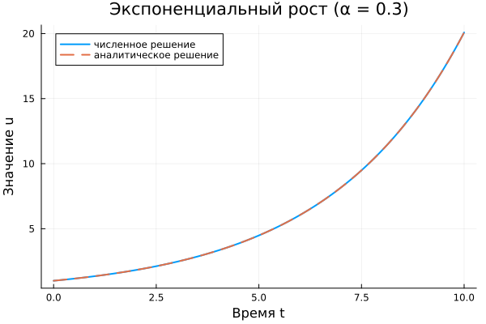

# Подготовка стенда. Модель экспоненциального роста
Бердыев Эзиз
2026-09-04

# Информация

## Докладчик

<div class="columns">

<div class="column" width="70%">

- Бердыев Эзиз
- студент группы НФИмд-01-25
- Российский университет дружбы народов им. П. Лумумбы
- <1032255390@rudn.ru>

</div>

<div class="column" width="30%">

</div>

</div>

# Вводная часть

## Актуальность

- Скорость развития инцидента информационной безопасности определяет,
  сколько времени есть у службы реагирования.
- На ранней стадии распространение вредоносного ПО в сети с большим
  числом уязвимых узлов растёт практически экспоненциально.
- Простейшая модель роста даёт верхнюю оценку скорости инцидента и
  служит эталоном для проверки вычислительного стенда.

## Объект и предмет исследования

- **Объект** — процессы, скорость изменения которых пропорциональна
  текущему значению величины.
- **Предмет** — численная и аналитическая модель экспоненциального
  роста, а также инструментальная среда её воспроизводимой реализации.

## Цели и задачи

**Цель** — подготовить рабочий стенд курса и выполнить на нём полный
цикл вычислительного эксперимента.

**Задачи:**

- развернуть рабочее пространство: git, Denote, DrWatson, Quarto;
- реализовать численное решение уравнения роста на языке Julia;
- получить аналитическое решение и сравнить его с численным;
- преобразовать код в литературный стиль;
- подготовить отчёт и презентацию во всех требуемых форматах.

## Материалы и методы

- Язык Julia \[1\];
- DifferentialEquations.jl, метод `Tsit5()` \[2\];
- DrWatson — структура научного проекта \[3\];
- Literate.jl — литературное программирование;
- Quarto — сборка отчёта и презентации \[4\].

# Основная часть

## Математическая модель

Модель описывается уравнением первого порядка:

$$
\frac{du}{dt} = \alpha u , \qquad u(0) = u_0 .
$$

Точное решение:

$$
u(t) = u_0 e^{\alpha t} .
$$

Знак $\alpha$ определяет поведение системы: рост, стационарность или
затухание.

## Время удвоения

$$
T_2 = \frac{\ln 2}{\alpha}
$$

- не зависит от начального значения $u_0$;
- удобно как практическая метрика скорости инцидента;
- при $\alpha = 0.3$ составляет $T_2 \approx 2.31$.

## Реализация правой части

``` julia
function exponential_growth!(du, u, p, t)
    α = p              # коэффициент роста
    du[1] = α * u[1]   # du/dt = αu
end
```

In-place форма не создаёт новых массивов и не нагружает сборщик мусора —
это рекомендуемая форма для DifferentialEquations.jl.

## Постановка и решение задачи Коши

``` julia
u0    = [1.0]
α     = 0.3
tspan = (0.0, 10.0)

prob = ODEProblem(exponential_growth!, u0, tspan, α)
sol  = solve(prob, Tsit5(), saveat = 0.1)
```

`Tsit5()` — явный метод Рунге—Кутты 5(4) порядка с адаптивным шагом.

## Результат: сравнение решений

<div id="fig-numeric">



Рис. 1: Численное и аналитическое решения при $\alpha = 0.3$

</div>

Максимальная относительная погрешность — $1.17 \cdot 10^{-5}$.

## Результат: набор параметров

<div id="fig-sweep">


Рис. 2: Влияние коэффициента роста на динамику системы

</div>

Рост $\alpha$ в 10 раз увеличивает $u(10)$ более чем в 8000 раз.

## Литературное программирование

Из одного литературного исходника получены три артефакта:

``` julia
Literate.script(src,   projectdir("scripts"))   # чистый код
Literate.notebook(src, projectdir("notebooks")) # jupyter notebook
Literate.markdown(src, projectdir("docs"))      # документация
```

Документация первична, код встраивается в изложение.

# Результаты

## Полученные результаты

- Развёрнут стенд: git на двух хостингах, именование Denote, проект
  DrWatson, сборка Quarto.
- Реализованы численное и аналитическое решения; графики совпадают.
- Вычислено время удвоения $T_2 \approx 2.31$ при $\alpha = 0.3$.
- Проведено исследование на наборе значений $\alpha$.
- Код преобразован в литературный стиль, сгенерированы все артефакты.

## Ограничения модели

- Модель предполагает неограниченность ресурса.
- Реальное число уязвимых узлов конечно, поэтому на поздних стадиях
  экспоненциальная модель завышает оценку.
- Для полного описания требуется логистическая модель.

## Итоговый слайд

- Цель работы достигнута: стенд подготовлен и проверен на эталонной
  задаче.
- Совпадение численного и аналитического решений подтверждает
  корректность настройки инструментов.
- Полученный стенд используется без изменений в последующих работах
  курса.

## Список литературы

<div id="refs" class="references csl-bib-body" entry-spacing="0">

<div id="ref-bezanson_julia_2017" class="csl-entry">

<span class="csl-left-margin">1.
</span><span class="csl-right-inline">Bezanson J. и др. [Julia: A Fresh
Approach to Numerical Computing](https://doi.org/10.1137/141000671) //
SIAM Review. 2017. Т. 59, № 1. С. 65–98.</span>

</div>

<div id="ref-rackauckas_differentialequations_2017" class="csl-entry">

<span class="csl-left-margin">2.
</span><span class="csl-right-inline">Rackauckas C., Nie Q.
[DifferentialEquations.jl — A Performant and Feature-Rich Ecosystem for
Solving Differential Equations in
Julia](https://doi.org/10.5334/jors.151) // Journal of Open Research
Software. 2017. Т. 5, № 1. С. 15.</span>

</div>

<div id="ref-datseris_drwatson_2020" class="csl-entry">

<span class="csl-left-margin">3.
</span><span class="csl-right-inline">Datseris G. и др. [DrWatson: the
perfect sidekick for your scientific
inquiries](https://doi.org/10.21105/joss.02673) // Journal of Open
Source Software. 2020. Т. 5, № 54. С. 2673.</span>

</div>

<div id="ref-quarto_2026" class="csl-entry">

<span class="csl-left-margin">4.
</span><span class="csl-right-inline">Posit PBC. [Quarto: An Open-Source
Scientific and Technical Publishing System](https://quarto.org/).
2026.</span>

</div>

</div>
