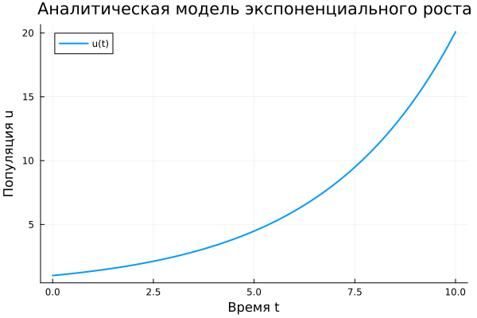
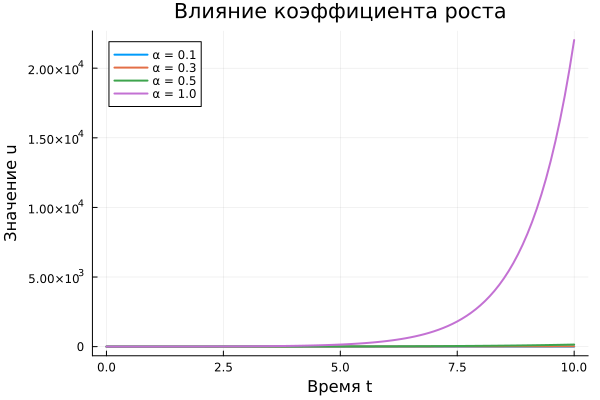

---
## Author
author:
  name: Бердыев Эзиз
  email: 1032255390@rudn.ru
  affiliation:
    - name: Российский университет дружбы народов
      country: Российская Федерация
      postal-code: 117198
      city: Москва
      address: ул. Миклухо-Маклая, д. 6

## Title
title: "Подготовка стенда. Модель экспоненциального роста"
subtitle: "Лабораторная работа № 1"
license: "CC BY"
date: today
date-format: "YYYY-MM-DD"
---

# Цель работы

Целью лабораторной работы является подготовка рабочего стенда для выполнения
курса «Методы математического моделирования в кибербезопасности» [@rudn_course]
и освоение полного цикла вычислительного эксперимента на примере простейшей
динамической модели — модели экспоненциального роста.

В рамках работы решаются две взаимосвязанные задачи:

- инженерная — развернуть воспроизводимое рабочее пространство: система
  контроля версий, соглашение об именовании файлов, структура проекта
  DrWatson [@datseris_drwatson_2020], система сборки отчётов Quarto
  [@quarto_2026];
- вычислительная — реализовать численное и аналитическое решение задачи
  экспоненциального роста на языке Julia [@bezanson_julia_2017] и сопоставить
  их между собой.

# Задание

В соответствии с методическими указаниями [@rudn_course] требуется:

1. Создать рабочий каталог для всего курса.
2. Создать рабочее пространство для программ в рамках лабораторной работы.
3. Выполнить все задания по тексту лабораторной работы.
4. Установить необходимые пакеты.
5. Выполнить предложенный код.
6. Преобразовать код в литературный стиль.
7. Сгенерировать из литературного кода: чистый код, jupyter notebook,
   документацию в формате Quarto.
8. Выполнить код из jupyter notebook.
9. Интегрировать документацию в формате Quarto в отчёт.
10. Добавить в код в литературном стиле вычисление для набора параметров и
    повторить генерацию артефактов.

# Теоретическое введение

## Модель экспоненциального роста

Экспоненциальный рост — процесс, в котором скорость изменения величины
пропорциональна её текущему значению. Модель описывается обыкновенным
дифференциальным уравнением первого порядка:

$$
\frac{du}{dt} = \alpha u ,
$$ {#eq-ode}

где $u(t)$ — значение моделируемой величины в момент времени $t$, а $\alpha$ —
коэффициент роста.

Уравнение (@eq-ode) допускает аналитическое решение:

$$
u(t) = u_0 e^{\alpha t} ,
$$ {#eq-analytic}

где $u_0 = u(0)$ — начальное значение.

Знак коэффициента $\alpha$ полностью определяет качественное поведение системы,
что сведено в [табл. @tbl-alpha].

| Значение $\alpha$ | Поведение системы          | Пример интерпретации в кибербезопасности          |
|-------------------|----------------------------|---------------------------------------------------|
| $\alpha > 0$      | Экспоненциальный рост      | Распространение сетевого червя в уязвимой подсети |
| $\alpha = 0$      | Стационарное состояние     | Постоянное число заражённых узлов                 |
| $\alpha < 0$      | Экспоненциальное затухание | Восстановление узлов после установки патча        |

: Качественное поведение модели в зависимости от знака коэффициента роста {#tbl-alpha}

## Время удвоения

Важной характеристикой процесса является время удвоения $T_2$ — интервал, за
который значение величины возрастает вдвое. Из (@eq-analytic) следует:

$$
T_2 = \frac{\ln 2}{\alpha} .
$$ {#eq-doubling}

Показатель $T_2$ удобен как практическая метрика: он не зависит от начального
значения $u_0$ и позволяет напрямую сравнивать скорость развития инцидентов.

## Численное решение

Для численного интегрирования (@eq-ode) применяется экосистема
DifferentialEquations.jl [@rackauckas_differentialequations_2017]. В работе
используется метод `Tsit5()` — явный метод Рунге—Кутты 5(4) порядка с
адаптивным шагом, являющийся методом по умолчанию для нежёстких задач.

Наличие точного решения (@eq-analytic) делает эту задачу удобным эталоном:
сопоставление численного и аналитического решений позволяет проверить
корректность настройки всего вычислительного стенда.

## Организация рабочего пространства

Воспроизводимость эксперимента обеспечивается тремя соглашениями курса
[@rudn_course]:

- **Denote** — соглашение об именовании файлов вида
  `DATE--TITLE__KEYWORDS.EXTENSION`, где поле `DATE` служит уникальным
  идентификатором файла;
- **DrWatson** [@datseris_drwatson_2020] — структура научного проекта,
  разделяющая исходный код (`src`), сценарии (`scripts`), данные (`data`) и
  результаты (`plots`), с функциями `projectdir`, `plotsdir`, `datadir`;
- **Literate.jl** — инструмент литературного программирования, позволяющий из
  одного исходного файла получить чистый код, Jupyter-блокнот и документацию.

# Выполнение лабораторной работы

## Подготовка рабочего пространства

Рабочее пространство курса развёрнуто в соответствии с иерархией,
предписанной методическими указаниями:

```bash
~/work/study/
└── 2026-1/
    └── 2026-1--study--security-modeling/
        └── labs/
            └── lab01/
                ├── project/       # проект DrWatson
                ├── report/        # отчёт
                └── presentation/  # презентация
```

Репозиторий проекта размещён на двух хостингах — GitHub и GitVerse.
Результирующие файлы отчёта и презентации оформлены в виде релиза git.

## Реализация численной модели

Правая часть уравнения (@eq-ode) реализована в виде функции, изменяющей вектор
производных «на месте» (in-place), что является рекомендуемой формой для
DifferentialEquations.jl (@lst-rhs).

```{#lst-rhs .julia lst-cap="Правая часть дифференциального уравнения"}
function exponential_growth!(du, u, p, t)
    α = p              # коэффициент роста передаётся как параметр задачи
    du[1] = α * u[1]   # du/dt = αu
end
```

Параметры вычислительного эксперимента заданы явно (@lst-params).

```{#lst-params .julia lst-cap="Параметры модели"}
u0    = [1.0]        # начальное значение u(0)
α     = 0.3          # коэффициент роста
tspan = (0.0, 10.0)  # интервал интегрирования
```

Задача формулируется и решается методом `Tsit5()` с сохранением решения с
постоянным шагом `saveat=0.1`, что упрощает последующее сравнение с
аналитическим решением (@lst-solve).

```{#lst-solve .julia lst-cap="Постановка и решение задачи Коши"}
prob = ODEProblem(exponential_growth!, u0, tspan, α)
sol  = solve(prob, Tsit5(), saveat=0.1)

savefig(plotsdir("exponential_growth_α=$α.png"))
```

Сохранение графика выполняется через функцию `plotsdir` пакета DrWatson: путь
вычисляется относительно корня проекта, поэтому сценарий работает независимо от
текущего каталога.

## Аналитическое решение

Для контроля численного решения отдельным сценарием вычисляется точное решение
(@eq-analytic), см. @lst-analytic.

```{#lst-analytic .julia lst-cap="Аналитическое решение и время удвоения"}
t = 0:0.1:10
u = u0 .* exp.(α .* t)          # точное решение u(t) = u₀·exp(αt)

doubling_time = log(2) / α      # время удвоения T₂ = ln2/α
```

## Результаты моделирования

Первые значения численного решения приведены в [табл. @tbl-values].

| $t$ | $u(t)$ |
|-----|--------|
| 0.0 | 1.0000 |
| 0.1 | 1.0305 |
| 0.2 | 1.0618 |
| 0.3 | 1.0942 |
| 0.4 | 1.1275 |

: Первые значения численного решения при $\alpha = 0.3$, $u_0 = 1$ {#tbl-values}

Численное решение задачи Коши в сопоставлении с аналитическим представлено на
[рис. @fig-numeric]. Кривые накладываются друг на друга: расхождение неразличимо
в масштабе рисунка.

{#fig-numeric width=80%}

Отдельно аналитическое решение, построенное по формуле (@eq-analytic),
приведено на [рис. @fig-analytic].

{#fig-analytic width=80%}

Совпадение графиков на [рис. @fig-numeric] и [рис. @fig-analytic]
подтверждает корректность численной схемы и настройки стенда.

Результат исследования на наборе значений коэффициента роста показан на
[рис. @fig-sweep].

{#fig-sweep width=80%}

## Литературное программирование

В соответствии с заданием код преобразован в литературный стиль средствами
Literate.jl. Исходный литературный файл размещён в каталоге
`project/literate`, а генерация артефактов выполняется одним сценарием
(@lst-literate).

```{#lst-literate .julia lst-cap="Генерация артефактов из литературного исходника"}
using Literate

src = projectdir("literate", "20260502T022300--exponential-growth__lab01_literate.jl")

Literate.script(src,   projectdir("scripts"))   # чистый код
Literate.notebook(src, projectdir("notebooks")) # jupyter notebook
Literate.markdown(src, projectdir("docs"))      # документация Quarto
```

Из одного источника получены три артефакта: исполняемый сценарий, Jupyter-блокнот
и Markdown-документация, включаемая в настоящий отчёт.

# Анализ результатов

Время удвоения, вычисленное по формуле (@eq-doubling) при $\alpha = 0.3$,
составляет

$$
T_2 = \frac{\ln 2}{0.3} \approx 2.31 .
$$

Это означает, что моделируемая величина возрастает вдвое приблизительно каждые
2.31 единицы времени. За рассмотренный интервал $t \in [0, 10]$ значение
увеличивается в $e^{3} \approx 20.1$ раза, что согласуется с [рис. @fig-numeric].

Сопоставление численного и аналитического решений показывает, что метод
`Tsit5()` с настройками по умолчанию обеспечивает точность, достаточную для
задач такого класса. По результатам расчёта максимальная абсолютная
погрешность на интервале $t \in [0, 10]$ составила $1.79 \cdot 10^{-4}$, а
максимальная относительная — $1.17 \cdot 10^{-5}$. Абсолютная погрешность
растёт вместе с самим решением, тогда как относительная остаётся практически
постоянной: это характерный признак корректно работающего метода с
адаптивным шагом, контролирующего именно относительную точность.

Результаты исследования на наборе значений коэффициента роста приведены в
[табл. @tbl-sweep].

| $\alpha$ | $u(10)$, численно | Время удвоения $T_2$ |
|----------|-------------------|----------------------|
| 0.1      | 2.718             | 6.931                |
| 0.3      | 20.085            | 2.310                |
| 0.5      | 148.409           | 1.386                |
| 1.0      | 22021.0           | 0.693                |

: Влияние коэффициента роста на конечное значение и время удвоения {#tbl-sweep}

Данные [табл. @tbl-sweep] и [рис. @fig-sweep] иллюстрируют главную особенность экспоненциального
процесса: рост коэффициента $\alpha$ в 10 раз (с 0.1 до 1.0) увеличивает
конечное значение более чем в 8000 раз. Именно эта чувствительность делает
раннее обнаружение инцидента критически важным.

Практическая значимость модели для кибербезопасности состоит в том, что на
ранней стадии распространения вредоносного ПО в сети с большим числом уязвимых
узлов число заражённых узлов растёт практически экспоненциально. Модель
(@eq-ode) даёт верхнюю оценку скорости инцидента и позволяет оценить время,
которым располагает служба реагирования.

Ограничение модели заключается в предположении о неограниченности ресурса:
реальное число заражаемых узлов конечно, поэтому на поздних стадиях
экспоненциальная модель завышает оценку и должна заменяться логистической.

# Ответы на контрольные вопросы

**1. Что такое математическая модель и зачем она нужна?**

Математическая модель — формальное описание объекта или процесса на языке
математики. Она позволяет исследовать поведение системы вычислительным путём,
без постановки натурного эксперимента.

**2. Какое уравнение описывает экспоненциальный рост?**

Обыкновенное дифференциальное уравнение первого порядка (@eq-ode)
$du/dt = \alpha u$ с решением (@eq-analytic) $u(t) = u_0 e^{\alpha t}$.

**3. Что определяет коэффициент $\alpha$?**

Знак определяет качественное поведение (см. [табл. @tbl-alpha]), а модуль —
скорость процесса: чем больше $|\alpha|$, тем быстрее рост или затухание.

**4. Что такое время удвоения и от чего оно зависит?**

Время, за которое величина возрастает вдвое, вычисляемое по (@eq-doubling).
Оно зависит только от $\alpha$ и не зависит от начального значения $u_0$.

**5. Зачем нужен пакет DrWatson?**

DrWatson [@datseris_drwatson_2020] задаёт стандартную структуру научного
проекта и предоставляет функции путей (`projectdir`, `plotsdir`, `datadir`),
именование файлов по параметрам (`savename`) и кэширование результатов. Это
обеспечивает воспроизводимость эксперимента.

**6. В чём смысл литературного программирования?**

Программа записывается как связный текст, объясняющий логику решения, а код
встраивается в это изложение. Из одного источника операцией *tangle*
получается исполняемый код, операцией *weave* — документ для чтения.

**7. Почему численное решение сравнивается с аналитическим?**

Наличие точного решения даёт эталон для верификации: совпадение решений
подтверждает корректность как численного метода, так и настройки стенда.

# Выводы

В ходе лабораторной работы развёрнут рабочий стенд курса и выполнен полный цикл
вычислительного эксперимента:

- создано рабочее пространство в соответствии с соглашением об именовании
  Denote, репозиторий размещён на GitHub и GitVerse, результаты оформлены
  релизом git;
- создан проект DrWatson с разделением кода, сценариев и результатов;
- реализовано численное решение уравнения (@eq-ode) методом `Tsit5()` и
  аналитическое решение по формуле (@eq-analytic);
- проведено сравнение решений, подтвердившее корректность реализации;
- вычислено время удвоения $T_2 \approx 2.31$ при $\alpha = 0.3$;
- код преобразован в литературный стиль, из него сгенерированы чистый код,
  Jupyter-блокнот и документация Quarto;
- отчёт и презентация подготовлены в Markdown и собраны во все требуемые
  производные форматы.

Освоенный стенд используется без изменений в последующих лабораторных работах
курса.

# Список литературы {.unnumbered}

::: {#refs}
:::
