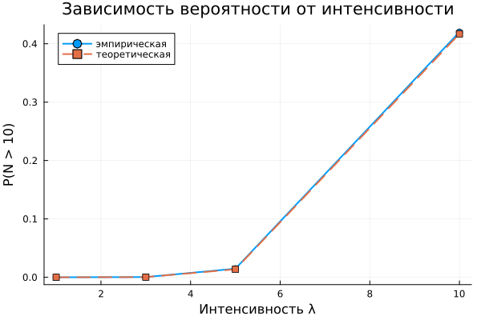

# Основы вероятностного моделирования угроз
Бердыев Эзиз
2026-09-04

# Информация

## Докладчик

<div class="columns">

<div class="column" width="70%">

- Бердыев Эзиз
- студент группы НФИмд-01-25
- Российский университет дружбы народов им. П. Лумумбы
- <1032255390@rudn.ru>

</div>

<div class="column" width="30%">

</div>

</div>

# Вводная часть

## Актуальность

- Поток атак на сервер — случайный процесс, и планировать защиту по
  среднему значению недостаточно.
- Практический вопрос звучит иначе: какова вероятность, что нагрузка
  превысит критический порог?
- Ответ на него определяет запас производительности и пороги
  срабатывания систем обнаружения атак.

## Объект и предмет исследования

- **Объект** — поток атак на веб-сервер как случайный процесс.
- **Предмет** — пуассоновская модель потока и точность статистической
  оценки вероятности редкого события.

## Цели и задачи

**Цель** — освоить базовые методы вероятностного моделирования случайных
процессов в контексте кибербезопасности.

**Задачи:**

- реализовать модель пуассоновского потока атак;
- проверить соответствие числа атак и интервалов теоретическим законам;
- оценить вероятность события «более 10 атак за час» двумя способами;
- исследовать сходимость оценки при росте объёма выборки;
- выполнить параметрическое исследование по интенсивности.

## Материалы и методы

- Язык Julia \[1\], пакеты Distributions.jl, StatsPlots.jl;
- DrWatson — структура проекта и именование результатов \[2\];
- теория пуассоновских процессов \[3\];
- Literate.jl — литературное программирование.

# Основная часть

## Модель потока

Число атак за интервал $T$:

$$
P\{N(T) = k\} = \frac{(\lambda T)^k}{k!}\, e^{-\lambda T} .
$$

Интервалы между атаками:

$$
f_\tau(x) = \lambda e^{-\lambda x} .
$$

Это два эквивалентных описания одного процесса — оба используются в
коде.

## Реализация

``` julia
function simulate_attacks(λ::Float64, T::Float64)
    hourly_counts = rand(Poisson(λ), floor(Int, T))

    intervals = Float64[]
    total_time = 0.0
    while total_time < T
        τ = rand(Exponential(1 / λ))
        push!(intervals, τ)
        total_time += τ
    end
    total_time > T && pop!(intervals)

    return (hourly_counts = hourly_counts,
            intervals = intervals,
            attack_times = cumsum(intervals))
end
```

## Проверка распределений

<div id="fig-analysis">


Рис. 1: Распределение числа атак, накопление атак, интервалы и QQ-график

</div>

## Оценка вероятности перегрузки

Событие «более 10 атак за час» при $\lambda = 5$:

<div id="tbl-probs">

Табл. 1: Сравнение оценок вероятности

| Способ оценки             | Значение |
|---------------------------|----------|
| Теоретический             | 0.013695 |
| Эмпирический, $n = 10^4$  | 0.016800 |
| Стандартная ошибка оценки | 0.001163 |

</div>

Расхождение — около $2.7\,\sigma$: редкое событие наступило всего 168
раз, поэтому разброс оценки велик.

## Сходимость оценки

<div id="fig-convergence">


Рис. 2: Сходимость эмпирической оценки к теоретическому значению

</div>

При $n = 10^4$ отклонение составило $5 \cdot 10^{-6}$.

## Набор параметров

<div id="fig-sweep">



Рис. 3: Зависимость вероятности перегрузки от интенсивности потока

</div>

# Результаты

## Полученные результаты

- Модель реализована, результаты сохраняются на диск средствами
  DrWatson.
- Число атак согласуется с законом Пуассона, интервалы — с показательным
  законом (гистограммы и QQ-график).
- Вероятность перегрузки оценена двумя способами; расхождение
  укладывается в случайный разброс.
- Подтверждён закон больших чисел: с ростом $n$ оценка стабилизируется.
- Код преобразован в литературный стиль.

## Главный вывод

- При удвоении интенсивности с 5 до 10 атак/час вероятность перегрузки
  растёт примерно в 30 раз.
- Зависимость резко нелинейна: запас по производительности, рассчитанный
  на среднюю нагрузку, перестаёт работать при небольшом росте
  интенсивности.

## Итоговый слайд

- Цель работы достигнута: методы вероятностного моделирования освоены на
  практической задаче.
- Модель корректно описывает случайный поток событий.
- Результат применим для обоснования порогов систем обнаружения атак.

## Список литературы

<div id="refs" class="references csl-bib-body" entry-spacing="0">

<div id="ref-bezanson_julia_2017" class="csl-entry">

<span class="csl-left-margin">1.
</span><span class="csl-right-inline">Bezanson J. и др. [Julia: A Fresh
Approach to Numerical Computing](https://doi.org/10.1137/141000671) //
SIAM Review. 2017. Т. 59, № 1. С. 65–98.</span>

</div>

<div id="ref-datseris_drwatson_2020" class="csl-entry">

<span class="csl-left-margin">2.
</span><span class="csl-right-inline">Datseris G. и др. [DrWatson: the
perfect sidekick for your scientific
inquiries](https://doi.org/10.21105/joss.02673) // Journal of Open
Source Software. 2020. Т. 5, № 54. С. 2673.</span>

</div>

<div id="ref-kingman_poisson_1993" class="csl-entry">

<span class="csl-left-margin">3.
</span><span class="csl-right-inline">Kingman J. F. C. Poisson
Processes. Oxford: Oxford University Press, 1993. 104 с.</span>

</div>

</div>
