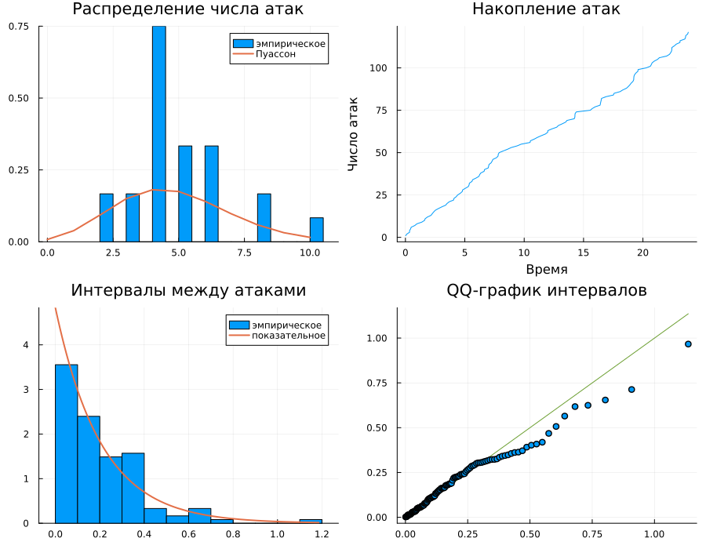
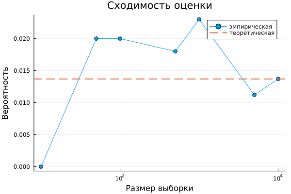

---
## Author
author:
  name: Бердыев Эзиз
  email: 1032255390@rudn.ru
  affiliation:
    - name: Российский университет дружбы народов
      country: Российская Федерация
      postal-code: 117198
      city: Москва
      address: ул. Миклухо-Маклая, д. 6

## Title
title: "Основы вероятностного моделирования угроз"
subtitle: "Лабораторная работа № 2"
license: "CC BY"
date: today
date-format: "YYYY-MM-DD"
---

# Цель работы

Целью лабораторной работы является освоение базовых методов вероятностного
моделирования случайных процессов в контексте кибербезопасности
[@rudn_course].

На примере моделирования потока атак на веб-сервер изучаются:

- пуассоновский поток событий как модель потока атак;
- связь между распределением числа событий и распределением интервалов между
  ними;
- методы оценки вероятности редкого события — теоретический и эмпирический;
- поведение статистической оценки при росте объёма выборки.

# Задание

В соответствии с методическими указаниями [@rudn_course] требуется:

1. Создать проект DrWatson с именем `project`.
2. Определить набор параметров модели (словарь `params`) с возможностью
   варьирования.
3. Написать функцию `simulate_attacks(params)`, возвращающую структуру с
   результатами симуляции: массив числа атак по часам, интервалы, моменты
   времени.
4. Использовать сохранение результатов на диск для запуска симуляции с
   заданными параметрами.
5. Провести серию экспериментов с разными значениями параметров.
6. Загрузить сохранённые результаты и выполнить:
   - построение гистограммы числа атак за час и сравнение с теоретическим
     распределением Пуассона;
   - построение графика накопленного числа атак и интервалов между атаками;
   - проверку экспоненциальности интервалов (гистограмма, QQ-график);
   - оценку вероятности события «более 10 атак за час» теоретически и
     эмпирически.
7. Проанализировать зависимость точности оценки вероятности от числа
   симуляций.
8. Преобразовать код в литературный стиль и сгенерировать из него чистый код,
   Jupyter-блокнот и документацию Quarto.

# Теоретическое введение

## Пуассоновский поток событий

Поток атак на сервер моделируется пуассоновским процессом — случайным
процессом, описывающим поток событий, наступающих независимо друг от друга с
постоянной интенсивностью $\lambda$ [@kingman_poisson_1993].

Число событий $N(T)$ за интервал длины $T$ подчиняется распределению Пуассона:

$$
P\{N(T) = k\} = \frac{(\lambda T)^k}{k!}\, e^{-\lambda T},
\qquad k = 0, 1, 2, \ldots
$$ {#eq-poisson}

Математическое ожидание и дисперсия числа событий совпадают:

$$
\mathrm{E}[N(T)] = \mathrm{D}[N(T)] = \lambda T .
$$ {#eq-moments}

Равенство (@eq-moments) даёт простой практический критерий: если выборочное
среднее заметно отличается от выборочной дисперсии, гипотеза о пуассоновости
потока сомнительна.

## Интервалы между событиями

Пуассоновский процесс допускает эквивалентное описание через интервалы между
соседними событиями. Интервал $\tau$ распределён по показательному закону
[@ross_probability_models_2019]:

$$
f_\tau(x) = \lambda e^{-\lambda x}, \qquad x \geqslant 0,
\qquad \mathrm{E}[\tau] = \frac{1}{\lambda} .
$$ {#eq-exp}

Показательное распределение — единственное непрерывное распределение,
обладающее свойством отсутствия последействия: вероятность того, что следующая
атака произойдёт в ближайшие $\Delta t$, не зависит от того, сколько времени
прошло с предыдущей. Именно это свойство формализует предположение о
независимости атак.

Два описания процесса сведены в [табл. @tbl-descriptions].

| Описание процесса | Случайная величина            | Закон распределения     | Параметр    |
|-------------------|-------------------------------|-------------------------|-------------|
| По числу событий  | $N(T)$ — атак за интервал $T$ | Пуассона (@eq-poisson)  | $\lambda T$ |
| По интервалам     | $\tau$ — время между атаками  | Показательный (@eq-exp) | $\lambda$   |

: Два эквивалентных описания пуассоновского потока {#tbl-descriptions}

## Оценка вероятности редкого события

Практический интерес представляет вероятность перегрузки сервера — события
«более $k$ атак за час». Теоретически она вычисляется через функцию
распределения:

$$
P\{N > k\} = 1 - \sum_{i=0}^{k} \frac{\lambda^i}{i!}\, e^{-\lambda} .
$$ {#eq-tail}

Эмпирическая оценка строится как частота: доля часов в выборке объёма $n$, в
которых число атак превысило порог. По закону больших чисел эта частота
сходится по вероятности к истинному значению (@eq-tail) при $n \to \infty$
[@gmurman_probability_ru]. Стандартная ошибка оценки частоты составляет

$$
\sigma_{\hat{p}} = \sqrt{\frac{p(1-p)}{n}} ,
$$ {#eq-se}

то есть убывает как $1/\sqrt{n}$. Формула (@eq-se) даёт масштаб, с которым
следует сравнивать наблюдаемые расхождения.

# Выполнение лабораторной работы

## Параметры модели

Параметры собраны в словарь: такая форма позволяет и варьировать их, и
использовать функцию `savename` пакета DrWatson [@datseris_drwatson_2020] для
формирования имени файла с результатами (@lst-params).

```{#lst-params .julia lst-cap="Параметры вычислительного эксперимента"}
params = Dict(
    :λ => 5.0,                   # интенсивность потока, атак в час
    :T => 24.0,                  # длительность наблюдения, часов
    :num_hours_for_est => 10000, # объём выборки для оценки вероятности
)

k_threshold = 10                 # порог: «более 10 атак за час»
```

## Реализация модели потока

Функция `simulate_attacks` возвращает три величины: почасовое число атак,
интервалы между атаками и моменты их наступления (@lst-sim). Число атак за час
генерируется напрямую из распределения (@eq-poisson), а интервалы — из
распределения (@eq-exp); тем самым в коде явно используются оба эквивалентных
описания процесса.

```{#lst-sim .julia lst-cap="Моделирование пуассоновского потока атак"}
function simulate_attacks(λ::Float64, T::Float64)
    hourly_counts = rand(Poisson(λ), floor(Int, T))

    intervals = Float64[]
    total_time = 0.0

    # накапливаем интервалы, пока не выйдем за горизонт наблюдения T
    while total_time < T
        τ = rand(Exponential(1 / λ))
        push!(intervals, τ)
        total_time += τ
    end

    # последний интервал вывел за пределы T — отбрасываем его
    if total_time > T
        pop!(intervals)
    end

    attack_times = cumsum(intervals)

    return (hourly_counts = hourly_counts,
            intervals = intervals,
            attack_times = attack_times)
end
```

## Запуск эксперимента

В ходе эксперимента вычисляются обе оценки вероятности события «более 10 атак
за час»: эмпирическая — как частота по выборке объёма $n = 10^4$,
теоретическая — по формуле (@eq-tail). Результаты сохраняются на диск с
именем файла, построенным по параметрам (@lst-run).

```{#lst-run .julia lst-cap="Оценка вероятности перегрузки сервера"}
emp_prob   = count(hourly_sample .> k_threshold) / num_hours_for_est
theor_prob = 1 - cdf(Poisson(λ), k_threshold)

filename = datadir("attack_sim", savename(params, "jld2"))
mkpath(datadir("attack_sim"))
@save filename data
```

Полученные значения приведены в [табл. @tbl-probs].

| Способ оценки                        | Значение $P\{N > 10\}$ |
|--------------------------------------|------------------------|
| Теоретический, по формуле (@eq-tail) | 0.013695               |
| Эмпирический, выборка $n = 10^4$     | 0.016800               |
| Абсолютное расхождение               | 0.003105               |
| Стандартная ошибка по (@eq-se)       | 0.001163               |

: Сравнение теоретической и эмпирической оценок вероятности при $\lambda = 5$ {#tbl-probs}

Расхождение составляет около $2.7\,\sigma_{\hat{p}}$. Для единичной реализации
это допустимое отклонение: оценка редкого события по выборке в 10 тысяч
наблюдений опирается всего на 168 наступивших событий, поэтому её случайный
разброс велик. Систематического смещения здесь нет — в этом убеждает
исследование сходимости (см. ниже), где при том же объёме выборки оценка
0.0137 совпала с теоретической до четвёртого знака.

## Анализ распределений

Для проверки соответствия модели теории построены четыре графика
([рис. @fig-analysis]):

1. гистограмма числа атак за час в сравнении с законом Пуассона (@eq-poisson);
2. график накопленного числа атак во времени;
3. гистограмма интервалов между атаками в сравнении с законом (@eq-exp);
4. QQ-график интервалов относительно показательного распределения.

{#fig-analysis width=95%}

Гистограмма числа атак повторяет форму теоретического распределения Пуассона.
График накопления атак близок к прямой с угловым коэффициентом $\lambda$, что
отражает постоянство интенсивности потока. Гистограмма интервалов имеет
характерную убывающую форму показательного распределения, а точки QQ-графика
ложатся вблизи прямой — значит, эмпирические квантили интервалов согласуются с
теоретическими.

## Исследование сходимости

Зависимость эмпирической оценки от объёма выборки исследована на сетке
значений $n$ от 10 до $10^4$ (@lst-conv). Численные результаты приведены в
[табл. @tbl-conv], графически — на [рис. @fig-convergence].

```{#lst-conv .julia lst-cap="Исследование сходимости оценки вероятности"}
Ns = [10, 50, 100, 500, 1000, 5000, 10000]
estimates = Float64[]

for N in Ns
    sample = rand(Poisson(λ), N)
    push!(estimates, count(sample .> k_threshold) / N)
end

theoretical = 1 - cdf(Poisson(λ), k_threshold)
```

| Объём выборки $n$ | Эмпирическая оценка | Модуль отклонения |
|-------------------|---------------------|-------------------|
| 10                | 0.0000              | 0.013695          |
| 50                | 0.0200              | 0.006305          |
| 100               | 0.0200              | 0.006305          |
| 500               | 0.0180              | 0.004305          |
| 1000              | 0.0230              | 0.009305          |
| 5000              | 0.0112              | 0.002495          |
| 10000             | 0.0137              | 0.000005          |

: Сходимость эмпирической оценки к теоретическому значению 0.013695 {#tbl-conv}

{#fig-convergence width=80%}

При $n = 10$ событие «более 10 атак за час» не встретилось ни разу, и оценка
обратилась в нуль — для редких событий малые выборки неинформативны в
принципе. Отклонение убывает немонотонно: при $n = 1000$ оно оказалось больше,
чем при $n = 500$. Это ожидаемо, поскольку каждая оценка — случайная величина,
и убывает по закону (@eq-se) не сама ошибка, а её стандартное отклонение. Общая
тенденция к уменьшению разброса видна отчётливо: при $n = 10^4$ отклонение
составило $5 \cdot 10^{-6}$.

## Вычисление для набора параметров

Согласно заданию модель исследована на наборе значений интенсивности
(@lst-sweep). Результат представлен в [табл. @tbl-sweep] и на
[рис. @fig-sweep].

```{#lst-sweep .julia lst-cap="Параметрическое исследование по интенсивности"}
λ_values = [1.0, 3.0, 5.0, 10.0]
N = 10_000

for λ in λ_values
    sample = rand(Poisson(λ), N)
    emp   = count(sample .> k_threshold) / N
    theor = 1 - cdf(Poisson(λ), k_threshold)
end
```

| $\lambda$, атак/час | Эмпирическая $P\{N > 10\}$ | Теоретическая $P\{N > 10\}$ |
|---------------------|----------------------------|-----------------------------|
| 1.0                 | 0.0000                     | 0.00000001                  |
| 3.0                 | 0.0004                     | 0.000292                    |
| 5.0                 | 0.0147                     | 0.013695                    |
| 10.0                | 0.4201                     | 0.416960                    |

: Зависимость вероятности перегрузки от интенсивности потока {#tbl-sweep}

{#fig-sweep width=80%}

Зависимость существенно нелинейна. При $\lambda = 1$ вероятность имеет порядок
$10^{-8}$, и выборка в 10 тысяч наблюдений принципиально не способна её
обнаружить — эмпирическая оценка равна нулю. При удвоении интенсивности с 5 до
10 атак/час вероятность перегрузки возрастает примерно в 30 раз. Это важный
практический вывод: запас по производительности, рассчитанный на среднюю
нагрузку, перестаёт работать при сравнительно небольшом росте интенсивности
атак.

## Литературное программирование

Код преобразован в литературный стиль средствами Literate.jl. Литературный
исходник размещён в каталоге `project/literate`, генерация артефактов
выполняется одним сценарием (@lst-literate).

```{#lst-literate .julia lst-cap="Генерация артефактов из литературного исходника"}
using Literate

src = projectdir("literate",
                 "20260404T190000--poisson-attack-flow__lab02_literate.jl")

Literate.script(src,   projectdir("scripts"))    # чистый код
Literate.notebook(src, projectdir("notebooks"))  # jupyter notebook
Literate.markdown(src, projectdir("docs"))       # документация Quarto
```

Из одного источника получены три артефакта: исполняемый сценарий,
Jupyter-блокнот и Markdown-документация.

# Ответы на контрольные вопросы

**1. Что такое пуассоновский процесс?**

Случайный процесс, описывающий поток событий, наступающих независимо друг от
друга с постоянной интенсивностью $\lambda$. Число событий за интервал
подчиняется распределению (@eq-poisson).

**2. Какими свойствами обладает пуассоновский поток?**

Стационарность (интенсивность постоянна), отсутствие последействия (события на
непересекающихся интервалах независимы) и ординарность (вероятность
наступления двух событий одновременно пренебрежимо мала).

**3. Почему интервалы между событиями распределены показательно?**

Вероятность отсутствия событий на интервале длины $x$ равна
$P\{N(x) = 0\} = e^{-\lambda x}$ по формуле (@eq-poisson). Следовательно,
$P\{\tau > x\} = e^{-\lambda x}$, что и есть показательное распределение
(@eq-exp).

**4. В чём разница между эмпирической и теоретической вероятностью?**

Теоретическая вычисляется аналитически из модели по формуле (@eq-tail).
Эмпирическая — частота события в конечной выборке, то есть сама случайная
величина со стандартной ошибкой (@eq-se). При корректной модели и большом
объёме выборки они близки, что показано в [табл. @tbl-probs] и
[табл. @tbl-conv].

**5. Что утверждает закон больших чисел и как он проявился в работе?**

Частота события сходится по вероятности к его вероятности при росте числа
испытаний. В работе это видно в [табл. @tbl-conv] и на
[рис. @fig-convergence]: с ростом $n$ разброс оценки убывает, а сама оценка
стабилизируется у теоретического значения.

**6. Зачем нужен QQ-график?**

Он сопоставляет выборочные квантили с теоретическими. Если точки ложатся
вблизи прямой, распределения согласуются. Это более чувствительный инструмент
проверки, чем визуальное сравнение гистограмм, особенно на хвостах
распределения.

**7. Как результат применяется на практике?**

Оценка $P\{N > k\}$ позволяет обосновать запас производительности сервера и
пороги срабатывания систем обнаружения атак: порог выбирается так, чтобы
вероятность ложного срабатывания на штатном потоке была приемлемо малой.

# Выводы

В ходе лабораторной работы:

- создан проект DrWatson, реализована модель пуассоновского потока атак с
  параметрами, вынесенными в отдельный словарь;
- функция `simulate_attacks` возвращает почасовое число атак, интервалы и
  моменты наступления событий; результаты сохраняются на диск с именем файла,
  построенным по параметрам;
- вероятность события «более 10 атак за час» оценена двумя способами
  (см. [табл. @tbl-probs]); расхождение единичной оценки составило
  $2.7\,\sigma$, что укладывается в случайный разброс;
- проверено соответствие числа атак распределению Пуассона, а интервалов —
  показательному распределению (см. [рис. @fig-analysis]);
- экспериментально подтверждён закон больших чисел: при $n = 10^4$ отклонение
  оценки от теоретического значения составило $5 \cdot 10^{-6}$
  (см. [табл. @tbl-conv]);
- выполнено параметрическое исследование по интенсивности потока, показавшее
  резко нелинейный рост вероятности перегрузки (см. [табл. @tbl-sweep]);
- код преобразован в литературный стиль, из него сгенерированы чистый код,
  Jupyter-блокнот и документация Quarto.

Полученная модель корректно описывает случайный поток событий и служит основой
для более сложных моделей, рассматриваемых в последующих работах курса.

# Список литературы {.unnumbered}

::: {#refs}
:::
