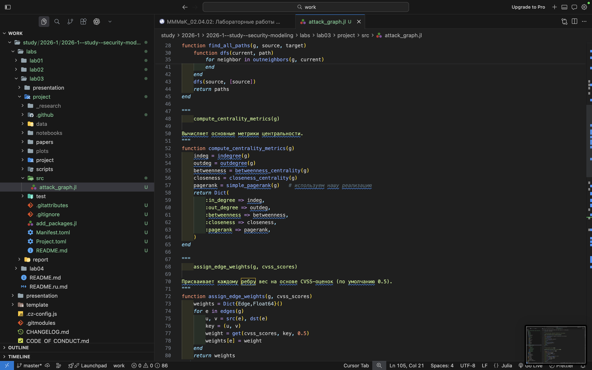
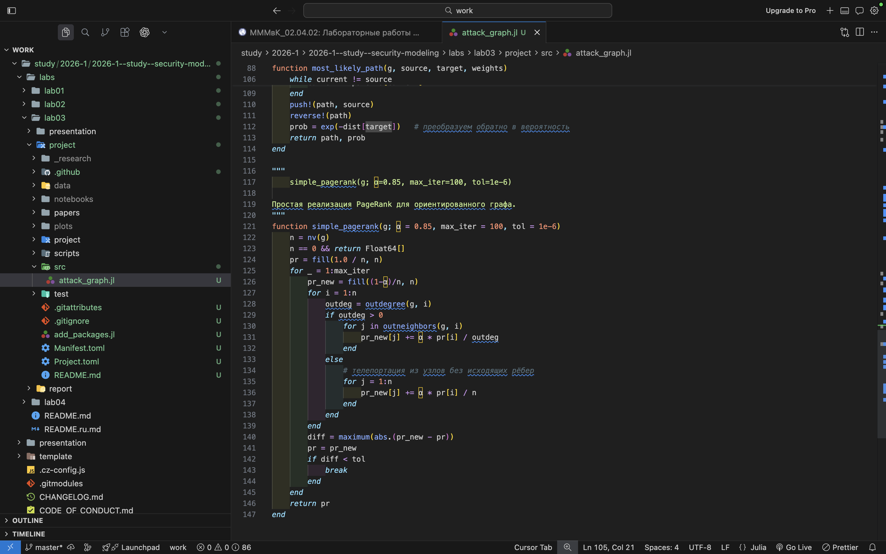
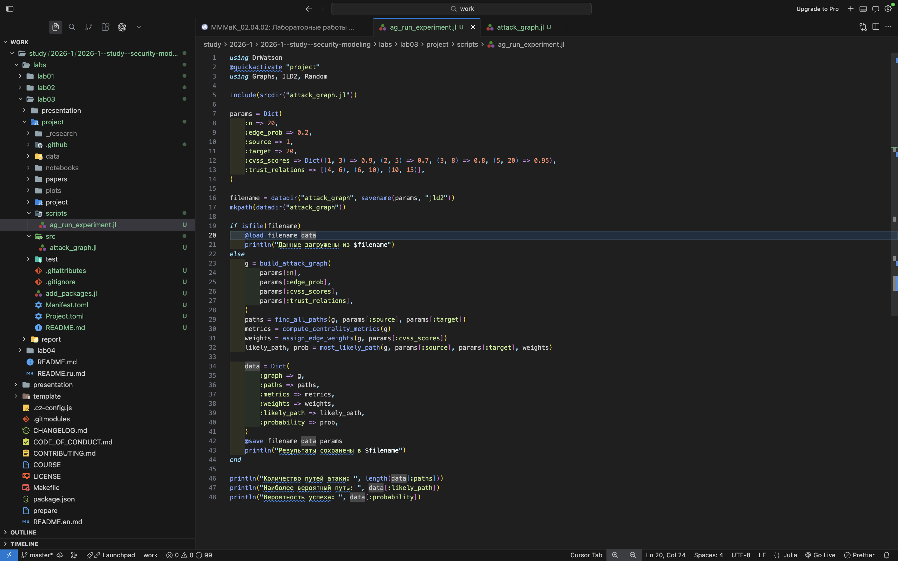
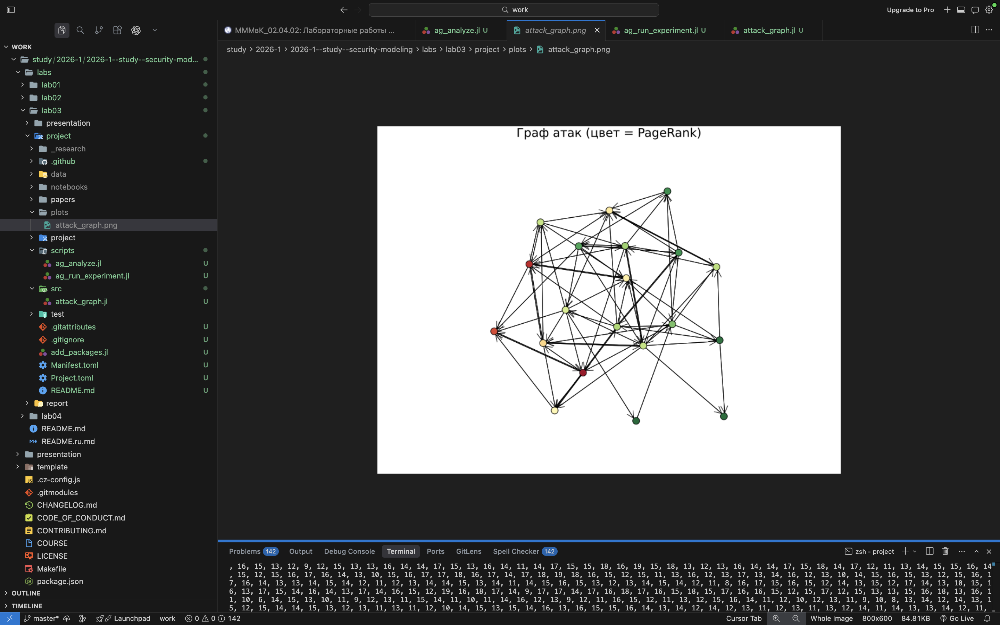
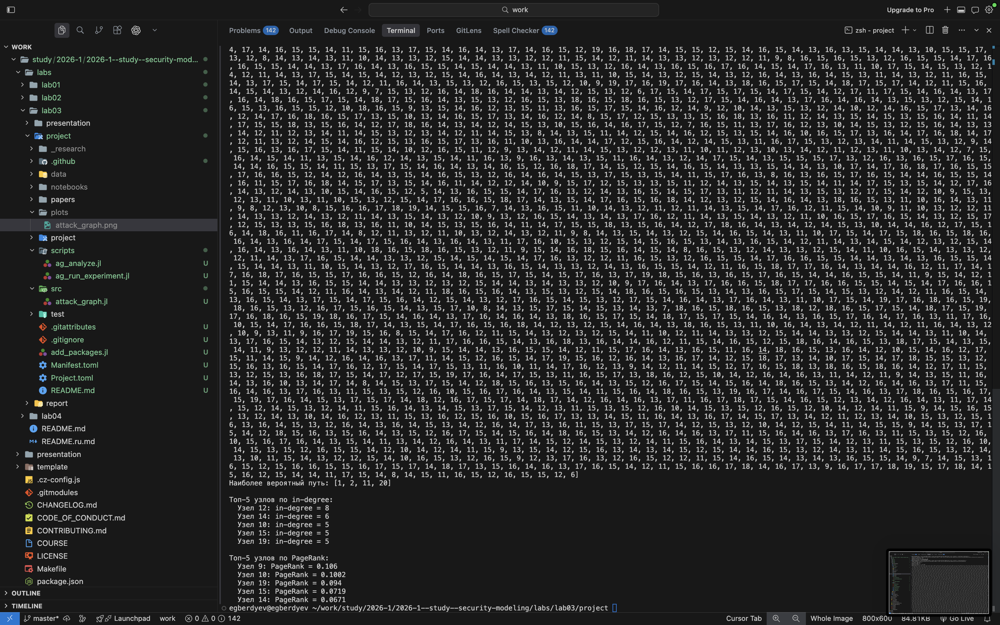
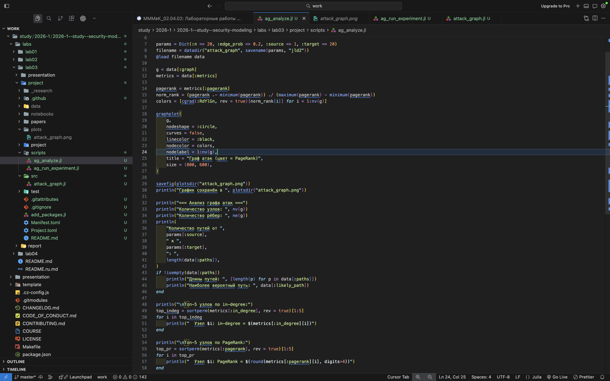
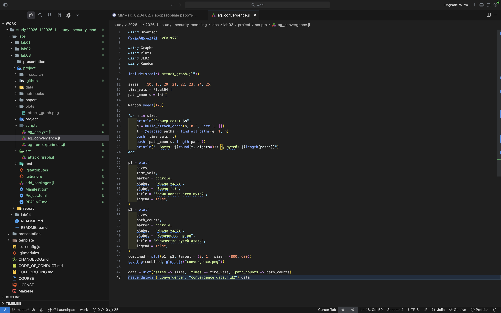
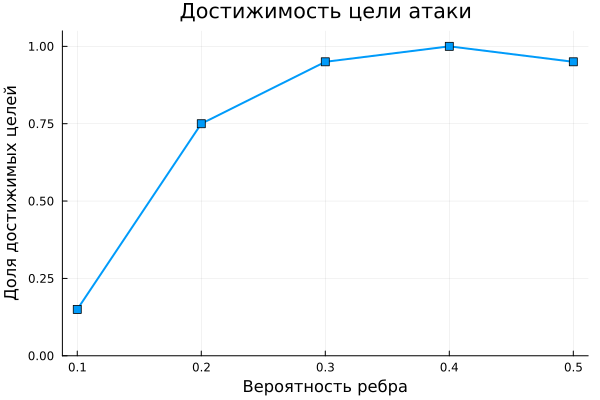

# Моделирование и анализ графов атак
Бердыев Эзиз
2026-09-04

- [<span class="toc-section-number">1</span> Цель работы](#цель-работы)
- [<span class="toc-section-number">2</span> Задание](#задание)
- [<span class="toc-section-number">3</span> Теоретическое
  введение](#теоретическое-введение)
  - [<span class="toc-section-number">3.1</span> Граф атак](#граф-атак)
  - [<span class="toc-section-number">3.2</span> Поиск путей
    атаки](#поиск-путей-атаки)
  - [<span class="toc-section-number">3.3</span> Метрики
    центральности](#метрики-центральности)
  - [<span class="toc-section-number">3.4</span> Вероятность успешной
    атаки](#вероятность-успешной-атаки)
- [<span class="toc-section-number">4</span> Выполнение лабораторной
  работы](#выполнение-лабораторной-работы)
  - [<span class="toc-section-number">4.1</span> Реализация графа
    атак](#реализация-графа-атак)
  - [<span class="toc-section-number">4.2</span> Запуск
    эксперимента](#запуск-эксперимента)
  - [<span class="toc-section-number">4.3</span> Визуализация и анализ
    графа](#визуализация-и-анализ-графа)
  - [<span class="toc-section-number">4.4</span> Исследование
    масштабируемости](#исследование-масштабируемости)
  - [<span class="toc-section-number">4.5</span> Параметрическое
    исследование](#параметрическое-исследование)
  - [<span class="toc-section-number">4.6</span> Литературное
    программирование](#литературное-программирование)
- [<span class="toc-section-number">5</span> Ответы на контрольные
  вопросы](#ответы-на-контрольные-вопросы)
- [<span class="toc-section-number">6</span> Выводы](#выводы)
- [Список литературы](#список-литературы)

# Цель работы

Целью лабораторной работы является изучение методов построения и анализа
графов атак для оценки защищённости сетевой инфраструктуры \[1\].

В рамках работы требуется не только реализовать алгоритмы, но и понять,
каким образом графовые модели позволяют формализовать процесс
проникновения, выявлять потенциальные сценарии атаки и находить
критические узлы сети.

# Задание

В соответствии с методическими указаниями \[1\] требуется:

1.  Создать рабочий каталог для кода и установить необходимые пакеты.
2.  Построить граф атак для заданной сети.
3.  Реализовать алгоритм поиска всех путей атаки.
4.  Вычислить метрики центральности.
5.  Оценить вероятность успешной атаки и найти наиболее вероятный путь.
6.  Визуализировать граф.
7.  Провести анализ масштабируемости.
8.  Выполнить параметрическое исследование.
9.  Преобразовать код в литературный стиль и сгенерировать из него
    чистый код, Jupyter-блокнот и документацию Quarto.

# Теоретическое введение

## Граф атак

Граф атак — ориентированный граф $G = (V, E)$, в котором вершины
соответствуют состояниям системы (например, узлам сети), а рёбра —
возможным действиям злоумышленника, переводящим систему из одного
состояния в другое \[2\]. Такая модель позволяет формализовать процесс
проникновения и систематически анализировать сценарии атак \[3\].

Помимо случайных рёбер, отражающих потенциальные переходы, в модель
вводятся *доверительные отношения* — заранее известные связи между
узлами, которыми злоумышленник может воспользоваться гарантированно.

## Поиск путей атаки

Для перечисления сценариев применяется поиск в глубину (DFS), находящий
все простые пути от точки входа до цели. Ограничение на повторное
посещение вершин исключает циклы.

Принципиальное ограничение метода — вычислительная сложность: число
простых путей в графе растёт экспоненциально с числом вершин, поэтому
полный перебор применим лишь к небольшим фрагментам инфраструктуры
\[4\]. Это ограничение проверяется экспериментально в разделе о
масштабируемости.

## Метрики центральности

Для выявления критических узлов используются метрики, сведённые в
<a href="#tbl-metrics" class="quarto-xref">табл. 1</a>.

<div id="tbl-metrics">

Табл. 1: Метрики центральности и их интерпретация в задачах защиты

| Метрика | Что показывает | Интерпретация для защиты |
|----|----|----|
| in-degree | Число входящих рёбер | Сколько способов скомпрометировать узел |
| betweenness | Доля кратчайших путей, проходящих через узел | Узел-посредник, «бутылочное горлышко» |
| closeness | Близость узла ко всем остальным | Насколько быстро распространится атака |
| PageRank | Важность узла с учётом важности его соседей | Приоритет узла при распределении ресурсов |

</div>

Метрика betweenness введена Фрименом \[5\], PageRank — Пейджем и Брином
\[6\]. Для ориентированного графа атак PageRank особенно содержателен:
он оценивает узел тем выше, чем важнее узлы, из которых в него можно
попасть.

## Вероятность успешной атаки

Каждому ребру $(i, j)$ сопоставляется вероятность $p_{ij}$ успешной
эксплуатации соответствующей уязвимости; на практике она выводится из
оценок CVSS \[7\]. Вероятность пути равна произведению вероятностей его
рёбер:

<span id="eq-path-prob">$$
P(\pi) = \prod_{(i,j) \in \pi} p_{ij} .
 \qquad(1)$$</span>

Прямая максимизация
(<a href="#eq-path-prob" class="quarto-xref">ур. 1</a>) неудобна.
Логарифмирование превращает произведение в сумму, а смена знака — задачу
максимизации в задачу минимизации:

<span id="eq-log-transform">$$
\arg\max_{\pi} \prod_{(i,j) \in \pi} p_{ij}
= \arg\min_{\pi} \sum_{(i,j) \in \pi} \bigl(-\ln p_{ij}\bigr) .
 \qquad(2)$$</span>

Так как $-\ln p_{ij} \geqslant 0$ при $p_{ij} \leqslant 1$, к задаче (1)
применим алгоритм Дейкстры.

# Выполнение лабораторной работы

## Реализация графа атак

Функция построения графа создаёт случайные рёбра с заданной вероятностью
(см. <a href="#fig-build" class="quarto-xref">рис. 1</a>), после чего
добавляет доверительные отношения (см.
<a href="#fig-trust" class="quarto-xref">рис. 2</a>).

<div id="fig-build">


Рис. 1: Код построения графа атак

</div>

<div id="fig-trust">



Рис. 2: Добавление доверительных отношений

</div>

Реализован рекурсивный поиск всех простых путей методом DFS с возвратом
(см. <a href="#fig-dfs" class="quarto-xref">рис. 3</a>).

<div id="fig-dfs">


Рис. 3: Поиск всех путей атаки (DFS с возвратом)

</div>

Вычисление метрик центральности из
<a href="#tbl-metrics" class="quarto-xref">табл. 1</a> показано на
<a href="#fig-centrality" class="quarto-xref">рис. 4</a>, собственная
реализация PageRank — на
<a href="#fig-pagerank" class="quarto-xref">рис. 5</a>.

<div id="fig-centrality">


Рис. 4: Вычисление метрик центральности

</div>

<div id="fig-pagerank">



Рис. 5: Реализация алгоритма PageRank

</div>

В реализации PageRank отдельно обрабатываются узлы без исходящих рёбер:
их вес распределяется равномерно по всем вершинам, иначе суммарный вес
не сохранялся бы.

## Запуск эксперимента

Параметры эксперимента задаются в отдельном сценарии (см.
<a href="#fig-exp-code" class="quarto-xref">рис. 6</a>), результаты
выполнения — на
<a href="#fig-exp-result" class="quarto-xref">рис. 7</a>.

<div id="fig-exp-code">



Рис. 6: Сценарий запуска эксперимента

</div>

<div id="fig-exp-result">


Рис. 7: Результаты выполнения эксперимента

</div>

Численные характеристики воспроизводимого прогона (зерно генератора
случайных чисел зафиксировано значением 20260502) приведены в
<a href="#tbl-experiment" class="quarto-xref">табл. 2</a>.

<div id="tbl-experiment">

Табл. 2: Результаты основного эксперимента

| Характеристика                       | Значение   |
|--------------------------------------|------------|
| Число узлов сети                     | 20         |
| Вероятность ребра                    | 0.2        |
| Число рёбер построенного графа       | 66         |
| Число простых путей из узла 1 в 20   | 1814       |
| Наиболее вероятный путь              | 1 → 7 → 20 |
| Вероятность наиболее вероятного пути | 0.25       |

</div>

Показателен разрыв между 1814 найденными путями и длиной наиболее
вероятного из них — всего два перехода. Вероятность
$0.25 = 0.5 \times 0.5$ получена на рёбрах со значением по умолчанию:
короткий путь оказывается вероятнее длинного, поскольку в произведении
(<a href="#eq-path-prob" class="quarto-xref">ур. 1</a>) каждый
дополнительный переход уменьшает итоговую вероятность.

## Визуализация и анализ графа

Построенный граф атак визуализирован с цветовой шкалой по значению
метрики центральности (см.
<a href="#fig-graph" class="quarto-xref">рис. 8</a>).

<div id="fig-graph">



Рис. 8: Визуализация графа атак

</div>

Результаты анализа графа приведены на
<a href="#fig-analysis-1" class="quarto-xref">рис. 9</a> и
<a href="#fig-analysis-2" class="quarto-xref">рис. 10</a>, сценарий
анализа — на
<a href="#fig-analysis-code" class="quarto-xref">рис. 11</a>.

<div id="fig-analysis-1">


Рис. 9: Анализ графа, часть 1

</div>

<div id="fig-analysis-2">



Рис. 10: Анализ графа, часть 2

</div>

<div id="fig-analysis-code">



Рис. 11: Сценарий анализа графа

</div>

Пять наиболее важных узлов по метрике PageRank приведены в
<a href="#tbl-critical" class="quarto-xref">табл. 3</a>.

<div id="tbl-critical">

Табл. 3: Критические узлы сети по метрикам центральности

| Узел | in-degree | betweenness | PageRank |
|------|-----------|-------------|----------|
| 11   | 7         | 0.193       | 0.1484   |
| 4    | 6         | 0.097       | 0.1144   |
| 6    | 4         | 0.304       | 0.1113   |
| 5    | 7         | 0.267       | 0.0985   |
| 10   | 4         | 0.251       | 0.0646   |

</div>

Данные <a href="#tbl-critical" class="quarto-xref">табл. 3</a>
показывают, что метрики упорядочивают узлы по-разному. Узел 11 лидирует
по PageRank, но его betweenness (0.193) ниже, чем у узла 6 (0.304),
имеющего вдвое меньший in-degree. Узел 6 входит в число доверительных
отношений $(4,6)$ и $(6,10)$ и потому лежит на большом числе путей,
оставаясь при этом «незаметным» для метрики степени. Практический вывод:
опора на одну метрику даёт неполную картину, критические узлы следует
выявлять по совокупности показателей.

## Исследование масштабируемости

Проверяется зависимость числа простых путей и времени их поиска от
размера сети (см.
<a href="#fig-scal-code" class="quarto-xref">рис. 12</a>). Отдельный
случайный граф — ненадёжная основа для вывода: в нём цель может
оказаться недостижимой из точки входа. Поэтому для каждого размера
результат усреднён по 20 независимым реализациям графа при фиксированной
плотности $p = 0.3$.

<div id="fig-scal-code">



Рис. 12: Сценарий исследования масштабируемости

</div>

Результаты приведены в
<a href="#tbl-scalability" class="quarto-xref">табл. 4</a> и на
<a href="#fig-scalability" class="quarto-xref">рис. 13</a>.

<div id="tbl-scalability">

Табл. 4: Зависимость числа путей и времени поиска от размера сети

| Число узлов $n$ | Среднее число путей | Среднее время поиска, с |
|-----------------|---------------------|-------------------------|
| 6               | 2.15                | 0.0000007               |
| 8               | 2.85                | 0.0000008               |
| 10              | 16.05               | 0.0000026               |
| 12              | 186.50              | 0.0000331               |
| 14              | 1318.45             | 0.0002456               |
| 16              | 59932.40            | 0.0137800               |

</div>

<div id="fig-scalability">


Рис. 13: Рост числа путей атаки с увеличением размера сети
(логарифмическая шкала)

</div>

Рост числа путей носит выраженно экспоненциальный характер: при
увеличении числа узлов с 6 до 16, то есть менее чем втрое, среднее число
путей возрастает с 2 до 60 тысяч — примерно в 28 тысяч раз. Время поиска
растёт пропорционально числу путей: с $0.7$ мкс до $13.8$ мс, то есть
почти в 20 тысяч раз. На логарифмической шкале
<a href="#fig-scalability" class="quarto-xref">рис. 13</a> зависимость
близка к прямой, что и означает экспоненциальный рост.

Отсюда следует практический вывод: полное перечисление путей атаки
нереализуемо уже для сетей в несколько десятков узлов, и для реальной
инфраструктуры необходимы метрики центральности, позволяющие выделить
критические узлы без построения всех путей.

## Параметрическое исследование

Исследуется влияние плотности сети — вероятности появления ребра — при
фиксированном числе узлов $n = 12$ (см.
<a href="#fig-sweep-code" class="quarto-xref">рис. 14</a>). Результат
также усреднён по 20 реализациям.

<div id="fig-sweep-code">


Рис. 14: Сценарий параметрического исследования

</div>

Результаты приведены в
<a href="#tbl-density" class="quarto-xref">табл. 5</a>, графически — на
<a href="#fig-density" class="quarto-xref">рис. 15</a> и
<a href="#fig-reachability" class="quarto-xref">рис. 16</a>.

<div id="tbl-density">

Табл. 5: Влияние плотности сети на число путей атаки и достижимость цели

| Вероятность ребра | Среднее число рёбер | Среднее число путей | Доля достижимых целей |
|----|----|----|----|
| 0.1 | 12.40 | 0.30 | 0.15 |
| 0.2 | 26.45 | 7.30 | 0.75 |
| 0.3 | 42.15 | 358.65 | 0.95 |
| 0.4 | 53.15 | 1705.70 | 1.00 |
| 0.5 | 64.50 | 9884.30 | 0.95 |

</div>

<div id="fig-density">


Рис. 15: Рост числа путей атаки с увеличением плотности сети

</div>

<div id="fig-reachability">



Рис. 16: Доля сетей, в которых цель достижима из точки входа

</div>

Плотность влияет на результат ещё резче, чем размер: при росте
вероятности ребра с 0.1 до 0.5 число рёбер увеличивается впятеро, а
среднее число путей — более чем в 30 тысяч раз.

Отдельного внимания заслуживает
<a href="#fig-reachability" class="quarto-xref">рис. 16</a>.
Достижимость цели растёт нелинейно и выходит на насыщение уже при
$p \approx 0.3$: в 95 % реализаций цель достижима. Снижение до 0.95 при
$p = 0.5$ объясняется случайным разбросом при 20 реализациях (одна
недостижимая сеть из двадцати) и не является содержательным эффектом.
Практический смысл: существует порог связности, после которого
дальнейшее «уплотнение» сети уже не меняет самого факта достижимости
цели, но продолжает лавинообразно увеличивать число сценариев атаки — то
есть усложняет анализ, не меняя принципиального вывода о защищённости.

## Литературное программирование

Код преобразован в литературный стиль средствами Literate.jl.
Литературный исходник размещён в каталоге `project/literate`, генерация
артефактов выполняется одним сценарием
(<a href="#lst-literate" class="quarto-xref">листинг 1</a>).

<div id="lst-literate">

Листинг 1: Генерация артефактов из литературного исходника

``` julia
using Literate

src = projectdir("literate",
                 "20260502T022300--attack-graph__lab03_literate.jl")

Literate.script(src,   projectdir("scripts"))    # чистый код
Literate.notebook(src, projectdir("notebooks"))  # jupyter notebook
Literate.markdown(src, projectdir("docs"))       # документация Quarto
```

</div>

# Ответы на контрольные вопросы

**1. Что такое граф атак?**

Ориентированный граф, вершины которого — состояния системы (узлы сети),
а рёбра — возможные действия злоумышленника. Модель формализует процесс
проникновения и позволяет анализировать сценарии атак \[3\].

**2. Какие алгоритмы используются для анализа?**

Поиск в глубину (DFS) — для перечисления всех простых путей атаки;
алгоритм Дейкстры — для поиска наиболее вероятного пути после
логарифмического преобразования (1).

**3. Что показывают метрики центральности?**

Каждая метрика отвечает на свой вопрос о важности узла (см.
<a href="#tbl-metrics" class="quarto-xref">табл. 1</a>). Как показано в
<a href="#tbl-critical" class="quarto-xref">табл. 3</a>, упорядочения по
разным метрикам не совпадают, поэтому критические узлы следует выявлять
по совокупности показателей.

**4. Как оценивается вероятность успешной атаки?**

Как произведение вероятностей рёбер вдоль пути
(<a href="#eq-path-prob" class="quarto-xref">ур. 1</a>). Вероятности
рёбер выводятся из оценок CVSS \[7\].

**5. Почему для поиска наиболее вероятного пути применяется алгоритм
Дейкстры?**

Алгоритм Дейкстры минимизирует сумму весов, а не максимизирует
произведение. Замена веса ребра на $-\ln p_{ij}$ по формуле (1) сводит
одну задачу к другой; веса при этом неотрицательны, что и требуется
алгоритмом.

**6. В чём ограничения модели?**

Модель статична: она не учитывает динамику системы, действия защитника и
изменение состояния узлов после компрометации. Вероятности рёбер
считаются независимыми, что на практике выполняется не всегда. Кроме
того, полный перебор путей вычислительно неосуществим для больших сетей
(см. <a href="#tbl-scalability" class="quarto-xref">табл. 4</a>).

**7. Как можно расширить модель?**

Ввести средства защиты как удаление или изменение весов рёбер, учесть
стоимость атаки и стоимость защиты, перейти к динамической модели
«Защитник—Нападающий», рассматриваемой в следующей лабораторной работе.

# Выводы

В ходе лабораторной работы:

- реализована модель графа атак с учётом доверительных отношений между
  узлами;
- реализован поиск всех простых путей атаки методом DFS; в основном
  эксперименте найдено 1814 путей (см.
  <a href="#tbl-experiment" class="quarto-xref">табл. 2</a>);
- вычислены метрики центральности, выявлены критические узлы сети (см.
  <a href="#tbl-critical" class="quarto-xref">табл. 3</a>); показано,
  что разные метрики дают разные упорядочения и требуют совместного
  анализа;
- реализована оценка вероятности атаки через произведение вероятностей
  рёбер и найден наиболее вероятный путь с помощью логарифмического
  преобразования
  1)  и алгоритма Дейкстры;
- выполнена визуализация графа;
- экспериментально подтверждён экспоненциальный рост числа путей атаки:
  при увеличении сети с 6 до 16 узлов среднее число путей выросло
  примерно в 28 тысяч раз (см.
  <a href="#tbl-scalability" class="quarto-xref">табл. 4</a>);
- проведено параметрическое исследование по плотности сети, выявившее
  порог связности, после которого достижимость цели выходит на насыщение
  (см. <a href="#fig-reachability" class="quarto-xref">рис. 16</a>);
- код преобразован в литературный стиль, из него сгенерированы чистый
  код, Jupyter-блокнот и документация Quarto.

Графы атак являются эффективным инструментом анализа защищённости,
однако прямое перечисление сценариев неприменимо к реальным сетям.
Практическую ценность имеют метрики центральности, позволяющие выделять
критические узлы без построения всех путей.

# Список литературы

<div id="refs" class="references csl-bib-body" entry-spacing="0">

<div id="ref-rudn_course" class="csl-entry">

<span class="csl-left-margin">1.
</span><span class="csl-right-inline">Российский университет дружбы
народов. [Методы математического моделирования в
кибербезопасности](https://esystem.rudn.ru/mod/resource/view.php?id=1359126).
2026.</span>

</div>

<div id="ref-phillips_swiler_1998" class="csl-entry">

<span class="csl-left-margin">2.
</span><span class="csl-right-inline">Phillips C., Swiler L. P. [A
Graph-Based System for Network-Vulnerability
Analysis](https://doi.org/10.1145/310889.310919) // Proceedings of the
1998 Workshop on New Security Paradigms (NSPW ’98). 1998. С.
71–79.</span>

</div>

<div id="ref-sheyner_attack_graphs_2002" class="csl-entry">

<span class="csl-left-margin">3.
</span><span class="csl-right-inline">Sheyner O. и др. [Automated
Generation and Analysis of Attack
Graphs](https://doi.org/10.1109/SECPRI.2002.1004377) // Proceedings of
the 2002 IEEE Symposium on Security and Privacy. 2002. С.
273–284.</span>

</div>

<div id="ref-ammann_scalable_2002" class="csl-entry">

<span class="csl-left-margin">4.
</span><span class="csl-right-inline">Ammann P., Wijesekera D., Kaushik
S. [Scalable, Graph-Based Network Vulnerability
Analysis](https://doi.org/10.1145/586110.586140) // Proceedings of the
9th ACM Conference on Computer and Communications Security (CCS ’02).
2002. С. 217–224.</span>

</div>

<div id="ref-freeman_betweenness_1977" class="csl-entry">

<span class="csl-left-margin">5.
</span><span class="csl-right-inline">Freeman L. C. [A Set of Measures
of Centrality Based on Betweenness](https://doi.org/10.2307/3033543) //
Sociometry. 1977. Т. 40, № 1. С. 35–41.</span>

</div>

<div id="ref-page_pagerank_1999" class="csl-entry">

<span class="csl-left-margin">6.
</span><span class="csl-right-inline">Page L. и др. The PageRank
Citation Ranking: Bringing Order to the Web: 1999-66. Stanford InfoLab,
1999.</span>

</div>

<div id="ref-first_cvss_2019" class="csl-entry">

<span class="csl-left-margin">7.
</span><span class="csl-right-inline">Forum of Incident Response and
Security Teams. [Common Vulnerability Scoring System version 3.1:
Specification
Document](https://www.first.org/cvss/v3.1/specification-document).
2019.</span>

</div>

</div>
