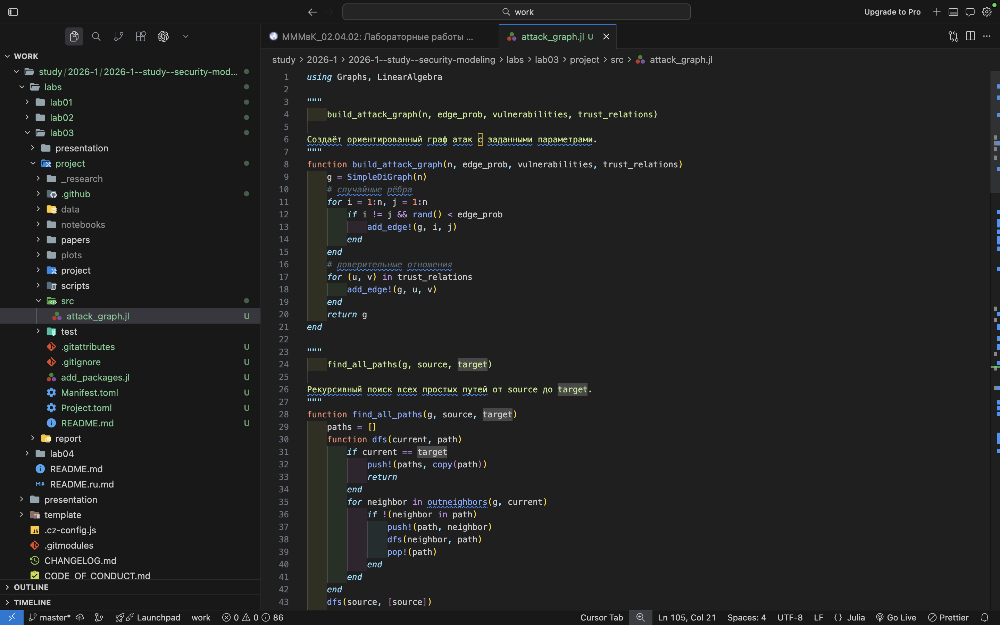
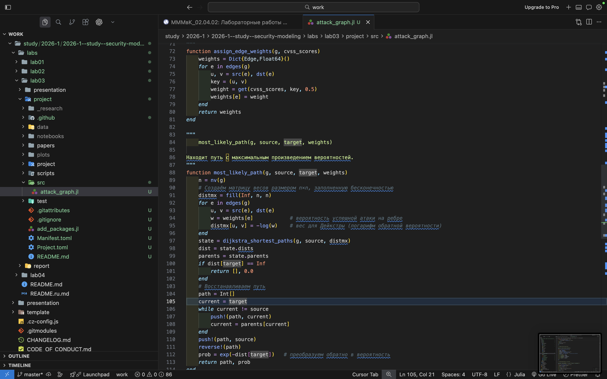
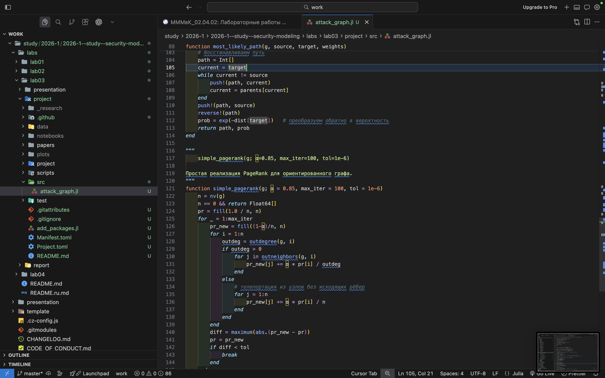
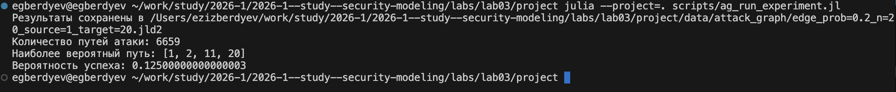
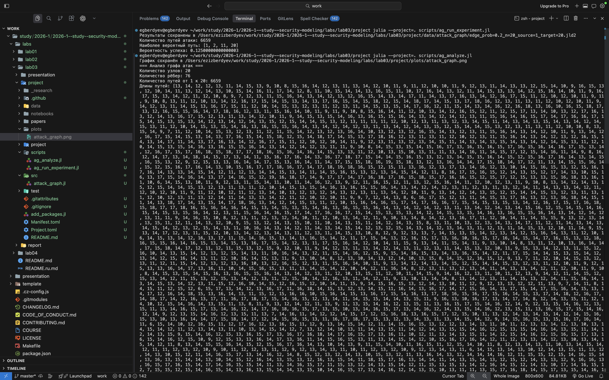
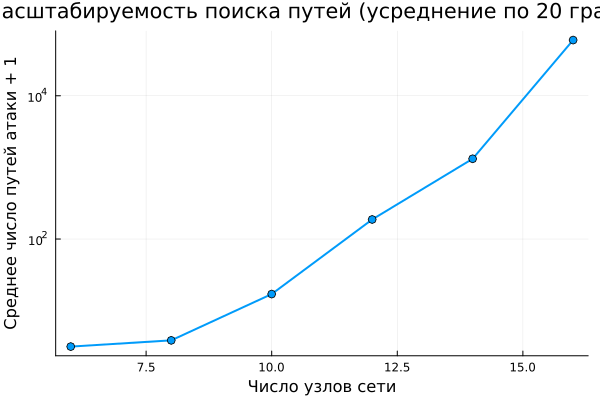
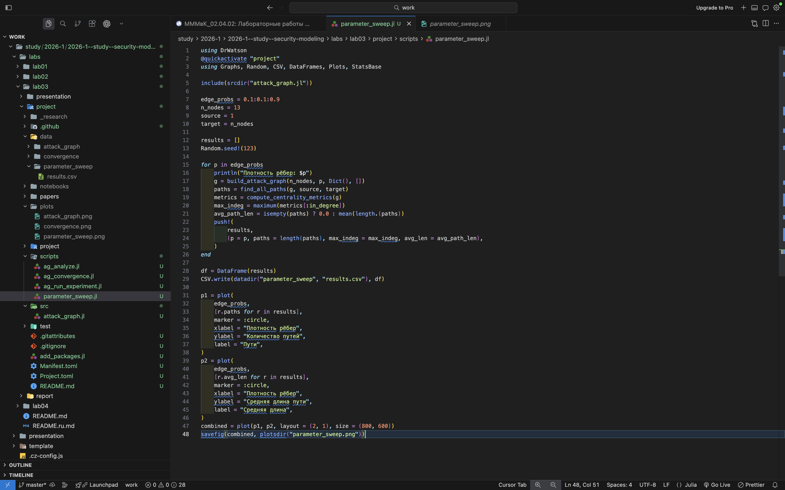
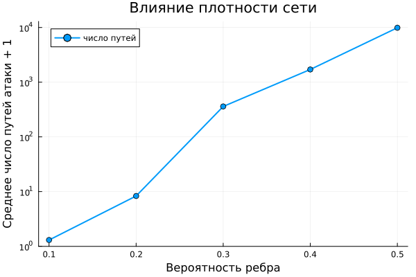

---
## Author
author:
  name: Бердыев Эзиз
  email: 1032255390@rudn.ru
  affiliation:
    - name: Российский университет дружбы народов
      country: Российская Федерация
      postal-code: 117198
      city: Москва
      address: ул. Миклухо-Маклая, д. 6

## Title
title: "Моделирование и анализ графов атак"
subtitle: "Лабораторная работа № 3"
license: "CC BY"
date: today
date-format: "YYYY-MM-DD"
---

# Цель работы

Целью лабораторной работы является изучение методов построения и анализа
графов атак для оценки защищённости сетевой инфраструктуры [@rudn_course].

В рамках работы требуется не только реализовать алгоритмы, но и понять, каким
образом графовые модели позволяют формализовать процесс проникновения,
выявлять потенциальные сценарии атаки и находить критические узлы сети.

# Задание

В соответствии с методическими указаниями [@rudn_course] требуется:

1. Создать рабочий каталог для кода и установить необходимые пакеты.
2. Построить граф атак для заданной сети.
3. Реализовать алгоритм поиска всех путей атаки.
4. Вычислить метрики центральности.
5. Оценить вероятность успешной атаки и найти наиболее вероятный путь.
6. Визуализировать граф.
7. Провести анализ масштабируемости.
8. Выполнить параметрическое исследование.
9. Преобразовать код в литературный стиль и сгенерировать из него чистый код,
   Jupyter-блокнот и документацию Quarto.

# Теоретическое введение

## Граф атак

Граф атак — ориентированный граф $G = (V, E)$, в котором вершины
соответствуют состояниям системы (например, узлам сети), а рёбра — возможным
действиям злоумышленника, переводящим систему из одного состояния в другое
[@phillips_swiler_1998]. Такая модель позволяет формализовать процесс
проникновения и систематически анализировать сценарии атак
[@sheyner_attack_graphs_2002].

Помимо случайных рёбер, отражающих потенциальные переходы, в модель вводятся
*доверительные отношения* — заранее известные связи между узлами, которыми
злоумышленник может воспользоваться гарантированно.

## Поиск путей атаки

Для перечисления сценариев применяется поиск в глубину (DFS), находящий все
простые пути от точки входа до цели. Ограничение на повторное посещение вершин
исключает циклы.

Принципиальное ограничение метода — вычислительная сложность: число простых
путей в графе растёт экспоненциально с числом вершин, поэтому полный перебор
применим лишь к небольшим фрагментам инфраструктуры
[@ammann_scalable_2002]. Это ограничение проверяется экспериментально
в разделе о масштабируемости.

## Метрики центральности

Для выявления критических узлов используются метрики, сведённые в
[табл. @tbl-metrics].

| Метрика         | Что показывает                                        | Интерпретация для защиты                 |
|-----------------|-------------------------------------------------------|------------------------------------------|
| in-degree       | Число входящих рёбер                                  | Сколько способов скомпрометировать узел  |
| betweenness     | Доля кратчайших путей, проходящих через узел          | Узел-посредник, «бутылочное горлышко»    |
| closeness       | Близость узла ко всем остальным                       | Насколько быстро распространится атака   |
| PageRank        | Важность узла с учётом важности его соседей           | Приоритет узла при распределении ресурсов|

: Метрики центральности и их интерпретация в задачах защиты {#tbl-metrics}

Метрика betweenness введена Фрименом [@freeman_betweenness_1977], PageRank —
Пейджем и Брином [@page_pagerank_1999]. Для ориентированного графа атак
PageRank особенно содержателен: он оценивает узел тем выше, чем важнее узлы,
из которых в него можно попасть.

## Вероятность успешной атаки

Каждому ребру $(i, j)$ сопоставляется вероятность $p_{ij}$ успешной
эксплуатации соответствующей уязвимости; на практике она выводится из оценок
CVSS [@first_cvss_2019]. Вероятность пути равна произведению вероятностей его
рёбер:

$$
P(\pi) = \prod_{(i,j) \in \pi} p_{ij} .
$$ {#eq-path-prob}

Прямая максимизация (@eq-path-prob) неудобна. Логарифмирование превращает
произведение в сумму, а смена знака — задачу максимизации в задачу
минимизации:

$$
\arg\max_{\pi} \prod_{(i,j) \in \pi} p_{ij}
= \arg\min_{\pi} \sum_{(i,j) \in \pi} \bigl(-\ln p_{ij}\bigr) .
$$ {#eq-log-transform}

Так как $-\ln p_{ij} \geqslant 0$ при $p_{ij} \leqslant 1$, к задаче
(@eq-log-transform) применим алгоритм Дейкстры.

# Выполнение лабораторной работы

## Реализация графа атак

Функция построения графа создаёт случайные рёбра с заданной вероятностью
(см. [рис. @fig-build]), после чего добавляет доверительные отношения
(см. [рис. @fig-trust]).

{#fig-build width=70%}

{#fig-trust width=70%}

Реализован рекурсивный поиск всех простых путей методом DFS с возвратом
(см. [рис. @fig-dfs]).

{#fig-dfs width=70%}

Вычисление метрик центральности из [табл. @tbl-metrics] показано на
[рис. @fig-centrality], собственная реализация PageRank — на
[рис. @fig-pagerank].

{#fig-centrality width=70%}

{#fig-pagerank width=70%}

В реализации PageRank отдельно обрабатываются узлы без исходящих рёбер: их вес
распределяется равномерно по всем вершинам, иначе суммарный вес не сохранялся
бы.

## Запуск эксперимента

Параметры эксперимента задаются в отдельном сценарии
(см. [рис. @fig-exp-code]), результаты выполнения — на
[рис. @fig-exp-result].

{#fig-exp-code width=70%}

{#fig-exp-result width=70%}

Численные характеристики воспроизводимого прогона (зерно генератора случайных
чисел зафиксировано значением 20260502) приведены в [табл. @tbl-experiment].

| Характеристика                     | Значение     |
|------------------------------------|--------------|
| Число узлов сети                   | 20           |
| Вероятность ребра                  | 0.2          |
| Число рёбер построенного графа     | 66           |
| Число простых путей из узла 1 в 20 | 1814         |
| Наиболее вероятный путь            | 1 → 7 → 20   |
| Вероятность наиболее вероятного пути | 0.25       |

: Результаты основного эксперимента {#tbl-experiment}

Показателен разрыв между 1814 найденными путями и длиной наиболее вероятного
из них — всего два перехода. Вероятность $0.25 = 0.5 \times 0.5$ получена на
рёбрах со значением по умолчанию: короткий путь оказывается вероятнее длинного,
поскольку в произведении (@eq-path-prob) каждый дополнительный переход
уменьшает итоговую вероятность.

## Визуализация и анализ графа

Построенный граф атак визуализирован с цветовой шкалой по значению метрики
центральности (см. [рис. @fig-graph]).

{#fig-graph width=70%}

Результаты анализа графа приведены на [рис. @fig-analysis-1] и
[рис. @fig-analysis-2], сценарий анализа — на [рис. @fig-analysis-code].

{#fig-analysis-1 width=70%}

{#fig-analysis-2 width=70%}

{#fig-analysis-code width=70%}

Пять наиболее важных узлов по метрике PageRank приведены в
[табл. @tbl-critical].

| Узел | in-degree | betweenness | PageRank |
|------|-----------|-------------|----------|
| 11   | 7         | 0.193       | 0.1484   |
| 4    | 6         | 0.097       | 0.1144   |
| 6    | 4         | 0.304       | 0.1113   |
| 5    | 7         | 0.267       | 0.0985   |
| 10   | 4         | 0.251       | 0.0646   |

: Критические узлы сети по метрикам центральности {#tbl-critical}

Данные [табл. @tbl-critical] показывают, что метрики упорядочивают узлы
по-разному. Узел 11 лидирует по PageRank, но его betweenness (0.193) ниже, чем
у узла 6 (0.304), имеющего вдвое меньший in-degree. Узел 6 входит в число
доверительных отношений $(4,6)$ и $(6,10)$ и потому лежит на большом числе
путей, оставаясь при этом «незаметным» для метрики степени. Практический вывод:
опора на одну метрику даёт неполную картину, критические узлы следует выявлять
по совокупности показателей.

## Исследование масштабируемости

Проверяется зависимость числа простых путей и времени их поиска от размера
сети (см. [рис. @fig-scal-code]). Отдельный случайный граф — ненадёжная основа
для вывода: в нём цель может оказаться недостижимой из точки входа. Поэтому
для каждого размера результат усреднён по 20 независимым реализациям графа при
фиксированной плотности $p = 0.3$.

{#fig-scal-code width=70%}

Результаты приведены в [табл. @tbl-scalability] и на [рис. @fig-scalability].

| Число узлов $n$ | Среднее число путей | Среднее время поиска, с |
|-----------------|---------------------|-------------------------|
| 6               | 2.15                | 0.0000007               |
| 8               | 2.85                | 0.0000008               |
| 10              | 16.05               | 0.0000026               |
| 12              | 186.50              | 0.0000331               |
| 14              | 1318.45             | 0.0002456               |
| 16              | 59932.40            | 0.0137800               |

: Зависимость числа путей и времени поиска от размера сети {#tbl-scalability}

{#fig-scalability width=80%}

Рост числа путей носит выраженно экспоненциальный характер: при увеличении
числа узлов с 6 до 16, то есть менее чем втрое, среднее число путей возрастает
с 2 до 60 тысяч — примерно в 28 тысяч раз. Время поиска растёт пропорционально
числу путей: с $0.7$ мкс до $13.8$ мс, то есть почти в 20 тысяч раз. На
логарифмической шкале [рис. @fig-scalability] зависимость близка к прямой, что
и означает экспоненциальный рост.

Отсюда следует практический вывод: полное перечисление путей атаки нереализуемо
уже для сетей в несколько десятков узлов, и для реальной инфраструктуры
необходимы метрики центральности, позволяющие выделить критические узлы без
построения всех путей.

## Параметрическое исследование

Исследуется влияние плотности сети — вероятности появления ребра — при
фиксированном числе узлов $n = 12$ (см. [рис. @fig-sweep-code]). Результат
также усреднён по 20 реализациям.

{#fig-sweep-code width=70%}

Результаты приведены в [табл. @tbl-density], графически — на
[рис. @fig-density] и [рис. @fig-reachability].

| Вероятность ребра | Среднее число рёбер | Среднее число путей | Доля достижимых целей |
|-------------------|---------------------|---------------------|-----------------------|
| 0.1               | 12.40               | 0.30                | 0.15                  |
| 0.2               | 26.45               | 7.30                | 0.75                  |
| 0.3               | 42.15               | 358.65              | 0.95                  |
| 0.4               | 53.15               | 1705.70             | 1.00                  |
| 0.5               | 64.50               | 9884.30             | 0.95                  |

: Влияние плотности сети на число путей атаки и достижимость цели {#tbl-density}

{#fig-density width=80%}

{#fig-reachability width=80%}

Плотность влияет на результат ещё резче, чем размер: при росте вероятности
ребра с 0.1 до 0.5 число рёбер увеличивается впятеро, а среднее число путей —
более чем в 30 тысяч раз.

Отдельного внимания заслуживает [рис. @fig-reachability]. Достижимость цели
растёт нелинейно и выходит на насыщение уже при $p \approx 0.3$: в 95 %
реализаций цель достижима. Снижение до 0.95 при $p = 0.5$ объясняется
случайным разбросом при 20 реализациях (одна недостижимая сеть из двадцати) и
не является содержательным эффектом. Практический смысл: существует порог
связности, после которого дальнейшее «уплотнение» сети уже не меняет самого
факта достижимости цели, но продолжает лавинообразно увеличивать число
сценариев атаки — то есть усложняет анализ, не меняя принципиального вывода о
защищённости.

## Литературное программирование

Код преобразован в литературный стиль средствами Literate.jl. Литературный
исходник размещён в каталоге `project/literate`, генерация артефактов
выполняется одним сценарием (@lst-literate).

```{#lst-literate .julia lst-cap="Генерация артефактов из литературного исходника"}
using Literate

src = projectdir("literate",
                 "20260502T022300--attack-graph__lab03_literate.jl")

Literate.script(src,   projectdir("scripts"))    # чистый код
Literate.notebook(src, projectdir("notebooks"))  # jupyter notebook
Literate.markdown(src, projectdir("docs"))       # документация Quarto
```

# Ответы на контрольные вопросы

**1. Что такое граф атак?**

Ориентированный граф, вершины которого — состояния системы (узлы сети), а
рёбра — возможные действия злоумышленника. Модель формализует процесс
проникновения и позволяет анализировать сценарии атак
[@sheyner_attack_graphs_2002].

**2. Какие алгоритмы используются для анализа?**

Поиск в глубину (DFS) — для перечисления всех простых путей атаки; алгоритм
Дейкстры — для поиска наиболее вероятного пути после логарифмического
преобразования (@eq-log-transform).

**3. Что показывают метрики центральности?**

Каждая метрика отвечает на свой вопрос о важности узла (см.
[табл. @tbl-metrics]). Как показано в [табл. @tbl-critical], упорядочения по
разным метрикам не совпадают, поэтому критические узлы следует выявлять по
совокупности показателей.

**4. Как оценивается вероятность успешной атаки?**

Как произведение вероятностей рёбер вдоль пути (@eq-path-prob). Вероятности
рёбер выводятся из оценок CVSS [@first_cvss_2019].

**5. Почему для поиска наиболее вероятного пути применяется алгоритм Дейкстры?**

Алгоритм Дейкстры минимизирует сумму весов, а не максимизирует произведение.
Замена веса ребра на $-\ln p_{ij}$ по формуле (@eq-log-transform) сводит одну
задачу к другой; веса при этом неотрицательны, что и требуется алгоритмом.

**6. В чём ограничения модели?**

Модель статична: она не учитывает динамику системы, действия защитника и
изменение состояния узлов после компрометации. Вероятности рёбер считаются
независимыми, что на практике выполняется не всегда. Кроме того, полный
перебор путей вычислительно неосуществим для больших сетей (см.
[табл. @tbl-scalability]).

**7. Как можно расширить модель?**

Ввести средства защиты как удаление или изменение весов рёбер, учесть
стоимость атаки и стоимость защиты, перейти к динамической модели
«Защитник—Нападающий», рассматриваемой в следующей лабораторной работе.

# Выводы

В ходе лабораторной работы:

- реализована модель графа атак с учётом доверительных отношений между узлами;
- реализован поиск всех простых путей атаки методом DFS; в основном
  эксперименте найдено 1814 путей (см. [табл. @tbl-experiment]);
- вычислены метрики центральности, выявлены критические узлы сети
  (см. [табл. @tbl-critical]); показано, что разные метрики дают разные
  упорядочения и требуют совместного анализа;
- реализована оценка вероятности атаки через произведение вероятностей рёбер
  и найден наиболее вероятный путь с помощью логарифмического преобразования
  (@eq-log-transform) и алгоритма Дейкстры;
- выполнена визуализация графа;
- экспериментально подтверждён экспоненциальный рост числа путей атаки: при
  увеличении сети с 6 до 16 узлов среднее число путей выросло примерно в 28
  тысяч раз (см. [табл. @tbl-scalability]);
- проведено параметрическое исследование по плотности сети, выявившее порог
  связности, после которого достижимость цели выходит на насыщение
  (см. [рис. @fig-reachability]);
- код преобразован в литературный стиль, из него сгенерированы чистый код,
  Jupyter-блокнот и документация Quarto.

Графы атак являются эффективным инструментом анализа защищённости, однако
прямое перечисление сценариев неприменимо к реальным сетям. Практическую
ценность имеют метрики центральности, позволяющие выделять критические узлы
без построения всех путей.

# Список литературы {.unnumbered}

::: {#refs}
:::
