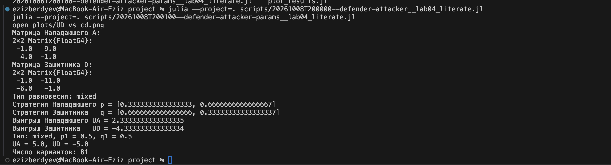

# Моделирование конфликта «Защитник–Нападающий»
Бердыев Эзиз
2026-10-08

# Информация

## Докладчик

- Бердыев Эзиз
- студент группы НФИмд-01-25
- Российский университет дружбы народов им. П. Лумумбы
- <1032255390@rudn.ru>

## Преподаватель

- Кулябов Дмитрий Сергеевич
- доктор физико-математических наук, профессор
- профессор кафедры теории вероятностей и кибербезопасности
- Российский университет дружбы народов им. П. Лумумбы

# Вводная часть

## Актуальность

- Защитник всегда ограничен в ресурсах: защитить всё одинаково сильно
  нельзя.
- Нападающий выбирает цель, наблюдая за защитой.
- Теория игр отвечает на вопрос: **как распределить защиту против
  рационального противника** \[1\].

## Объект, предмет, новизна, значимость

- **Объект** — противостояние защитника и нападающего в ИБ.
- **Предмет** — матричная игра «Защитник–Нападающий» и её равновесие
  Нэша.
- **Новизна** — получено явное решение $p_1 = V_2/(V_1+V_2)$,
  $q_1 = V_1/(V_1+V_2)$ и показано, что затраты не влияют на стратегии.
- **Практическая значимость** — обоснование рандомизации защиты.

## Цель и задачи

**Цель** — применить теорию игр к анализу конфликта в ИБ, найти
равновесие Нэша в чистых и смешанных стратегиях.

**Гипотеза** — рациональной защите выгодно быть непредсказуемой.

**Задачи:**

- формализовать конфликт как антагонистическую игру;
- реализовать на Julia расчёт матриц и равновесия;
- рассчитать игру для набора параметров и визуализировать результаты;
- перевести код в литературный стиль.

## Материалы и методы

- Теория игр, равновесие Нэша \[2,3\].
- Язык Julia \[4\], DrWatson \[5\].
- DataFrames, CSV, Plots — расчёты и графики.
- Literate.jl, Quarto \[6\] — литературный код, отчёт, презентация.

# Содержание исследования

## Модель

Два актива с ценностями $V_1, V_2$; $c_a$ — стоимость атаки, $c_d$ —
защиты.

$$
A_{ij} = \begin{cases} V_i - c_a, & i \ne j \\ -c_a, & i = j \end{cases}
\qquad
D_{ij} = \begin{cases} -V_i - c_d, & i \ne j \\ -c_d, & i = j \end{cases}
$$

Строка — какой актив атакуют, столбец — какой защищают.

## Поиск равновесия

1.  Проверка чистых равновесий: перебор 4 клеток.
2.  Если чистого нет — условие безразличия: каждый игрок рандомизирует
    так, чтобы противнику было всё равно, что выбрать.

$$
q_1^* = \frac{V_1}{V_1+V_2}, \qquad p_1^* = \frac{V_2}{V_1+V_2}
$$

## Базовый эксперимент: V = (10, 5), c = 1

Рис. 1: Результат расчёта

- $\mathbf{p} = (1/3,\ 2/3)$, $\mathbf{q} = (2/3,\ 1/3)$
- $U_A = 2.33$, $U_D = -4.33$

## Ценный актив атакуют реже

Рис. 2: Вероятность атаки на актив 1 от $V_1/V_2$

Защитник охраняет ценный актив чаще — Нападающий бьёт туда, где слабее.

## Выигрыш Нападающего

Рис. 3: Средний выигрыш Нападающего

Максимум $6.5$ при $V_1 = V_2 = 15$.

## Стоимость защиты

Рис. 4: Выигрыш Защитника от $c_d$

$c_d$ сдвигает выигрыш, но **не меняет стратегию**.

# Результаты

## Анализ и практическая значимость

- Все 81 вариант дали **смешанное** равновесие: модель устроена как
  «орлянка» — чистой стратегии нет.
- Непредсказуемость защиты — оптимальна: ротация honeypot, случайные
  проверки, moving target defense.
- Выигрыш Защитника всегда отрицателен: безопасность требует затрат.

## Выводы

- Конфликт формализован как биматричная игра, равновесие найдено
  численно и совпало с аналитическим решением.
- Гипотеза подтверждена: рациональной защите выгодно рандомизировать.
- Код переведён в литературный стиль, сгенерированы чистый код, блокноты
  и документация Quarto.

## Список литературы

1.
Tambe M. [Security and Game
Theory: Algorithms, Deployed Systems, Lessons
Learned](https://doi.org/10.1017/CBO9780511973031). Cambridge: Cambridge
University Press, 2011.

2.
Nash J. [Non-Cooperative
Games](https://doi.org/10.2307/1969529) // Annals of Mathematics. 1951.
Т. 54, № 2. С. 286–295.

3.
Neumann J. von, Morgenstern O.
Theory of Games and Economic Behavior. Princeton: Princeton University
Press, 1944.

4.
Bezanson J. и др. [Julia: A Fresh
Approach to Numerical Computing](https://doi.org/10.1137/141000671) //
SIAM Review. 2017. Т. 59, № 1. С. 65–98.

5.
Datseris G. и др. [DrWatson: the
perfect sidekick for your scientific
inquiries](https://doi.org/10.21105/joss.02673) // Journal of Open
Source Software. 2020. Т. 5, № 54. С. 2673.

6.
Posit PBC. [Quarto: An Open-Source
Scientific and Technical Publishing System](https://quarto.org/).
2026.

