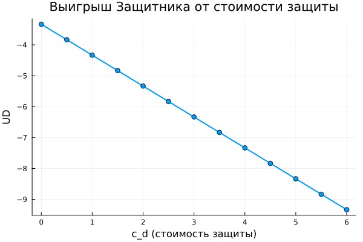

---
## Author
author:
  name: Бердыев Эзиз
  email: 1032255390@rudn.ru
  affiliation:
    - name: Российский университет дружбы народов им. П. Лумумбы
      country: Российская Федерация
      city: Москва

## Title
title: "Моделирование конфликта «Защитник–Нападающий»"
subtitle: "Лабораторная работа № 4. Преподаватель: Кулябов Дмитрий Сергеевич, д.ф.-м.н., профессор кафедры теории вероятностей и кибербезопасности"
institute: "Российский университет дружбы народов им. П. Лумумбы"
license: "CC BY"
date: today
date-format: "YYYY-MM-DD"
---

# Информация

## Докладчик

- Бердыев Эзиз
- студент группы НФИмд-01-25
- Российский университет дружбы народов им. П. Лумумбы
- [1032255390@rudn.ru](mailto:1032255390@rudn.ru)

## Преподаватель

- Кулябов Дмитрий Сергеевич
- доктор физико-математических наук, профессор
- профессор кафедры теории вероятностей и кибербезопасности
- Российский университет дружбы народов им. П. Лумумбы

# Вводная часть

## Актуальность

- Защитник всегда ограничен в ресурсах: защитить всё одинаково сильно нельзя.
- Нападающий выбирает цель, наблюдая за защитой.
- Теория игр отвечает на вопрос: **как распределить защиту против
  рационального противника** [@tambe_security_games_2011].

## Объект, предмет, новизна, значимость

- **Объект** — противостояние защитника и нападающего в ИБ.
- **Предмет** — матричная игра «Защитник–Нападающий» и её равновесие Нэша.
- **Новизна** — получено явное решение $p_1 = V_2/(V_1+V_2)$,
  $q_1 = V_1/(V_1+V_2)$ и показано, что затраты не влияют на стратегии.
- **Практическая значимость** — обоснование рандомизации защиты.

## Цель и задачи

**Цель** — применить теорию игр к анализу конфликта в ИБ, найти равновесие
Нэша в чистых и смешанных стратегиях.

**Гипотеза** — рациональной защите выгодно быть непредсказуемой.

**Задачи:**

- формализовать конфликт как антагонистическую игру;
- реализовать на Julia расчёт матриц и равновесия;
- рассчитать игру для набора параметров и визуализировать результаты;
- перевести код в литературный стиль.

## Материалы и методы

- Теория игр, равновесие Нэша [@nash_noncooperative_1951;
  @neumann_morgenstern_1944].
- Язык Julia [@bezanson_julia_2017], DrWatson [@datseris_drwatson_2020].
- DataFrames, CSV, Plots — расчёты и графики.
- Literate.jl, Quarto [@quarto_2026] — литературный код, отчёт, презентация.

# Содержание исследования

## Модель

Два актива с ценностями $V_1, V_2$; $c_a$ — стоимость атаки, $c_d$ — защиты.

$$
A_{ij} = \begin{cases} V_i - c_a, & i \ne j \\ -c_a, & i = j \end{cases}
\qquad
D_{ij} = \begin{cases} -V_i - c_d, & i \ne j \\ -c_d, & i = j \end{cases}
$$

Строка — какой актив атакуют, столбец — какой защищают.

## Поиск равновесия

1. Проверка чистых равновесий: перебор 4 клеток.
2. Если чистого нет — условие безразличия: каждый игрок рандомизирует так,
   чтобы противнику было всё равно, что выбрать.

$$
q_1^* = \frac{V_1}{V_1+V_2}, \qquad p_1^* = \frac{V_2}{V_1+V_2}
$$

## Базовый эксперимент: V = (10, 5), c = 1

{#fig-base width=90%}

- $\mathbf{p} = (1/3,\ 2/3)$, $\mathbf{q} = (2/3,\ 1/3)$
- $U_A = 2.33$, $U_D = -4.33$

## Ценный актив атакуют реже

{#fig-p1 width=65%}

Защитник охраняет ценный актив чаще — Нападающий бьёт туда, где слабее.

## Выигрыш Нападающего

{#fig-heat width=65%}

Максимум $6.5$ при $V_1 = V_2 = 15$.

## Стоимость защиты

{#fig-cd width=65%}

$c_d$ сдвигает выигрыш, но **не меняет стратегию**.

# Результаты

## Анализ и практическая значимость

- Все 81 вариант дали **смешанное** равновесие: модель устроена как
  «орлянка» — чистой стратегии нет.
- Непредсказуемость защиты — оптимальна: ротация honeypot, случайные
  проверки, moving target defense.
- Выигрыш Защитника всегда отрицателен: безопасность требует затрат.

## Выводы

- Конфликт формализован как биматричная игра, равновесие найдено численно и
  совпало с аналитическим решением.
- Гипотеза подтверждена: рациональной защите выгодно рандомизировать.
- Код переведён в литературный стиль, сгенерированы чистый код, блокноты и
  документация Quarto.

## Список литературы {.unnumbered .allowframebreaks}

::: {#refs}
:::
