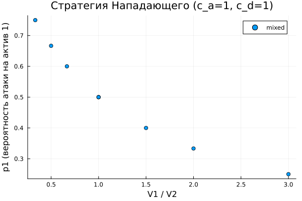
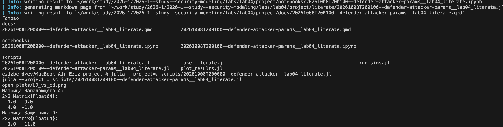

# Моделирование конфликта «Защитник–Нападающий»
Бердыев Эзиз
2026-10-08

- [<span class="toc-section-number">1</span> Цель работы](#цель-работы)
- [<span class="toc-section-number">2</span> Задание](#задание)
- [<span class="toc-section-number">3</span> Теоретическое
  введение](#теоретическое-введение)
  - [<span class="toc-section-number">3.1</span> Теория игр в
    информационной
    безопасности](#теория-игр-в-информационной-безопасности)
  - [<span class="toc-section-number">3.2</span> Платёжные
    матрицы](#платёжные-матрицы)
  - [<span class="toc-section-number">3.3</span> Равновесие
    Нэша](#равновесие-нэша)
- [<span class="toc-section-number">4</span> Выполнение лабораторной
  работы](#выполнение-лабораторной-работы)
  - [<span class="toc-section-number">4.1</span> Рабочий каталог и
    окружение](#рабочий-каталог-и-окружение)
  - [<span class="toc-section-number">4.2</span> Модель](#модель)
  - [<span class="toc-section-number">4.3</span> Базовый
    эксперимент](#базовый-эксперимент)
  - [<span class="toc-section-number">4.4</span> Расчёт для набора
    параметров](#расчёт-для-набора-параметров)
  - [<span class="toc-section-number">4.5</span>
    Визуализация](#визуализация)
  - [<span class="toc-section-number">4.6</span> Литературное
    программирование](#литературное-программирование)
    - [<span class="toc-section-number">4.6.1</span> Документация:
      базовая модель](#документация-базовая-модель)
    - [<span class="toc-section-number">4.6.2</span> Документация:
      расчёт для набора
      параметров](#документация-расчёт-для-набора-параметров)
- [<span class="toc-section-number">5</span> Ответы на контрольные
  вопросы](#ответы-на-контрольные-вопросы)
- [<span class="toc-section-number">6</span> Выводы](#выводы)
- [Список литературы](#список-литературы)

# Цель работы

Целью лабораторной работы является освоение применения теории игр для
анализа противостояния в сфере информационной безопасности \[1\]:
построение матричной игры и поиск равновесия Нэша в чистых и смешанных
стратегиях \[2\].

# Задание

В соответствии с методическими указаниями \[1\] требуется:

1.  Формализовать конфликт «Защитник–Нападающий» в виде
    антагонистической игры.
2.  Реализовать на Julia \[3\] функции расчёта платёжной матрицы, поиска
    равновесия Нэша и симуляции игры.
3.  Визуализировать зависимость ожидаемого выигрыша и равновесных
    вероятностей от стоимости защиты и величины ущерба.
4.  Создать рабочий каталог, установить пакеты, выполнить предложенный
    код.
5.  Преобразовать код в литературный стиль и сгенерировать из него
    чистый код, jupyter notebook и документацию в формате Quarto.
6.  Добавить в литературный код вычисление для набора параметров и
    повторить генерацию.
7.  Интегрировать документацию в формате Quarto в отчёт.

# Теоретическое введение

## Теория игр в информационной безопасности

Ситуации, в которых взаимодействуют стороны с противоположными
интересами, описываются моделями теории игр \[4\]. Защитник стремится
минимизировать ущерб, Нападающий — максимизировать его. Такой подход
широко применяется для планирования защиты реальных объектов \[5\].

Элементы модели сведены в
<a href="#tbl-elements" class="quarto-xref">табл. 1</a>.

<div id="tbl-elements">

Табл. 1: Основные элементы модели «Защитник–Нападающий»

| Элемент   | Содержание в модели                                           |
|-----------|---------------------------------------------------------------|
| Игроки    | Защитник (Defender, D) и Нападающий (Attacker, A)             |
| Активы    | $n = 2$ актива с ценностями $V_1, V_2 > 0$                    |
| Стратегии | Нападающий выбирает актив $i$ для атаки, Защитник — актив $j$ |
| Затраты   | $c_a$ — стоимость атаки, $c_d$ — стоимость защиты             |
| Тип игры  | Статическая: ходы одновременны, выбор противника неизвестен   |

</div>

## Платёжные матрицы

Результат зависит от того, совпали ли атакуемый и защищаемый активы.
Если $i \neq j$, атака успешна; если $i = j$, атака отражена:

<span id="eq-payoff">$$
A_{ij} =
\begin{cases}
V_i - c_a, & i \neq j, \\
-c_a, & i = j,
\end{cases}
\qquad
D_{ij} =
\begin{cases}
-V_i - c_d, & i \neq j, \\
-c_d, & i = j.
\end{cases}
 \qquad(1)$$</span>

При смешанных стратегиях $\mathbf{p}$ (Нападающий) и $\mathbf{q}$
(Защитник) ожидаемые выигрыши равны

<span id="eq-utility">$$
U_A = \mathbf{p}^T A \mathbf{q}, \qquad U_D = \mathbf{p}^T D \mathbf{q}.
 \qquad(2)$$</span>

## Равновесие Нэша

Пара стратегий $(\mathbf{p}^*, \mathbf{q}^*)$ — равновесие Нэша, если ни
одному игроку не выгодно в одиночку изменить свою стратегию \[2\]. Для
игры $2 \times 2$ без чистого равновесия смешанное находится из условия
безразличия: при равновесной стратегии противника ожидаемые выигрыши от
обеих чистых стратегий равны:

<span id="eq-indifference">$$
\begin{cases}
A_{11} q_1^* + A_{12}(1-q_1^*) = A_{21} q_1^* + A_{22}(1-q_1^*), \\
p_1^* D_{11} + (1-p_1^*) D_{21} = p_1^* D_{12} + (1-p_1^*) D_{22}.
\end{cases}
 \qquad(3)$$</span>

Подстановка (<a href="#eq-payoff" class="quarto-xref">ур. 1</a>) в
(<a href="#eq-indifference" class="quarto-xref">ур. 3</a>) даёт решение
в явном виде:

<span id="eq-solution">$$
q_1^* = \frac{V_1}{V_1 + V_2}, \qquad p_1^* = \frac{V_2}{V_1 + V_2}.
 \qquad(4)$$</span>

Затраты $c_a$ и $c_d$ входят во все клетки своих матриц одинаково,
поэтому на равновесные вероятности
(<a href="#eq-solution" class="quarto-xref">ур. 4</a>) не влияют, а лишь
сдвигают выигрыши.

# Выполнение лабораторной работы

## Рабочий каталог и окружение

Рабочий каталог `labs/lab04/project` создан в структуре DrWatson \[6\].
Окружение Julia воспроизводится из файлов `Project.toml` и
`Manifest.toml` с зафиксированными версиями пакетов
(<a href="#fig-env" class="quarto-xref">рис. 1</a>).

<div id="fig-env">


Рис. 1: Создание рабочего каталога и установка пакетов

</div>

## Модель

Модель реализована в файле `src/simulation.jl`. Построение платёжных
матриц по формулам (<a href="#eq-payoff" class="quarto-xref">ур. 1</a>)
приведено в <a href="#lst-payoff" class="quarto-xref">листинге 1</a>.

<div id="lst-payoff">

Листинг 1: Построение платёжных матриц

``` julia
function build_payoff_matrices(V::Vector{Float64}, c_a::Float64, c_d::Float64)
    n = length(V)
    A = zeros(n, n)  # Attacker
    D = zeros(n, n)  # Defender
    for i = 1:n, j = 1:n
        if i != j
            A[i, j] = V[i] - c_a
            D[i, j] = -V[i] - c_d
        else
            A[i, j] = -c_a
            D[i, j] = -c_d
        end
    end
    return A, D
end
```

</div>

Поиск равновесия (<a href="#lst-nash" class="quarto-xref">листинг 2</a>)
сначала проверяет чистые стратегии, затем решает систему
(<a href="#eq-indifference" class="quarto-xref">ур. 3</a>).

<div id="lst-nash">

Листинг 2: Поиск равновесия Нэша для игры 2×2 (фрагмент)

``` julia
for i = 1:2, j = 1:2
    if A[i, j] >= A[3-i, j] && D[i, j] >= D[i, 3-j]
        # чистое равновесие
    end
end
denomA = (A[1, 1] - A[2, 1]) - (A[1, 2] - A[2, 2])
q1 = clamp((A[2, 2] - A[1, 2]) / denomA, 0.0, 1.0)
denomD = (D[1, 1] - D[1, 2]) - (D[2, 1] - D[2, 2])
p1 = clamp((D[2, 2] - D[2, 1]) / denomD, 0.0, 1.0)
```

</div>

## Базовый эксперимент

Для $V = (10, 5)$, $c_a = c_d = 1$ получены матрицы и равновесие,
приведённые на <a href="#fig-base" class="quarto-xref">рис. 2</a> и в
<a href="#tbl-base" class="quarto-xref">табл. 2</a>.

<div id="fig-base">


Рис. 2: Результаты базового эксперимента

</div>

<div id="tbl-base">

Табл. 2: Результаты базового эксперимента при $V = (10, 5)$,
$c_a = c_d = 1$

| Величина                           | Значение                 |
|------------------------------------|--------------------------|
| Матрица Нападающего $A$            | $[-1\ \ 9;\ 4\ \ -1]$    |
| Матрица Защитника $D$              | $[-1\ \ -11;\ -6\ \ -1]$ |
| Тип равновесия                     | смешанное                |
| Стратегия Нападающего $\mathbf{p}$ | $(1/3,\ 2/3)$            |
| Стратегия Защитника $\mathbf{q}$   | $(2/3,\ 1/3)$            |
| Выигрыш Нападающего $U_A$          | $2.33$                   |
| Выигрыш Защитника $U_D$            | $-4.33$                  |

</div>

Результат совпадает с аналитическим решением
(<a href="#eq-solution" class="quarto-xref">ур. 4</a>):
$q_1^* = 10/15 = 2/3$, $p_1^* = 5/15 = 1/3$. Защитник чаще охраняет
ценный актив, поэтому Нападающему выгоднее чаще атаковать дешёвый. Для
симметричного случая $V = (10, 10)$ без затрат получено
$p_1 = q_1 = 0.5$, $U_A = 5$, $U_D = -5$: сумма выигрышей равна нулю —
игра антагонистическая.

## Расчёт для набора параметров

Сценарий `scripts/run_sims.jl` рассчитывает все 81 комбинацию
$V_1, V_2 \in \{5, 10, 15\}$, $c_a, c_d \in \{0, 1, 3\}$ и сохраняет их
в `data/sims/results.csv`
(<a href="#fig-sims" class="quarto-xref">рис. 3</a>).

<div id="fig-sims">


Рис. 3: Запуск расчёта для набора параметров

</div>

Все 81 равновесие оказались смешанными. Причина в структуре игры:
Защитнику всегда выгодно угадать цель атаки, а Нападающему — не угадать,
как в игре «орлянка», поэтому чистого равновесия не существует. Срез при
$c_a = c_d = 1$ приведён в
<a href="#tbl-grid" class="quarto-xref">табл. 3</a>.

<div id="tbl-grid">

Табл. 3: Равновесия и выигрыши при $c_a = c_d = 1$

| $V_1$ | $V_2$ | $p_1$ | $q_1$ | $U_A$ | $U_D$ |
|------:|------:|------:|------:|------:|------:|
|     5 |     5 | 0.500 | 0.500 |  1.50 | −3.50 |
|     5 |    10 | 0.667 | 0.333 |  2.33 | −4.33 |
|     5 |    15 | 0.750 | 0.250 |  2.75 | −4.75 |
|    10 |     5 | 0.333 | 0.667 |  2.33 | −4.33 |
|    10 |    10 | 0.500 | 0.500 |  4.00 | −6.00 |
|    10 |    15 | 0.600 | 0.400 |  5.00 | −7.00 |
|    15 |     5 | 0.250 | 0.750 |  2.75 | −4.75 |
|    15 |    10 | 0.400 | 0.600 |  5.00 | −7.00 |
|    15 |    15 | 0.500 | 0.500 |  6.50 | −8.50 |

</div>

## Визуализация

Зависимость вероятности атаки на актив 1 от отношения ценностей показана
на <a href="#fig-p1" class="quarto-xref">рис. 4</a>: чем ценнее актив 1,
тем реже его атакуют.

<div id="fig-p1">



Рис. 4: Вероятность атаки на актив 1 от отношения $V_1/V_2$

</div>

Средний выигрыш Нападающего
(<a href="#fig-heat" class="quarto-xref">рис. 5</a>) растёт, когда ценны
оба актива: максимум $6.5$ достигается при $V_1 = V_2 = 15$.

<div id="fig-heat">


Рис. 5: Средний выигрыш Нападающего в координатах $(V_1, V_2)$

</div>

Зависимость выигрыша Защитника от стоимости защиты
(<a href="#fig-cd" class="quarto-xref">рис. 6</a>) линейна: при росте
$c_d$ от 0 до 6 выигрыш падает с $-3.33$ до $-9.33$, а равновесные
стратегии не меняются.

<div id="fig-cd">


Рис. 6: Выигрыш Защитника от стоимости защиты $c_d$ при $V = (10, 5)$,
$c_a = 1$

</div>

## Литературное программирование

Код переведён в литературный стиль средствами Literate.jl: два исходника
в каталоге `project/literate` — базовая модель и вычисление для набора
параметров. Из них сценарием `scripts/make_literate.jl` сгенерированы
чистый код, jupyter-блокноты и документация Quarto
(<a href="#fig-literate" class="quarto-xref">рис. 7</a>).

<div id="fig-literate">



Рис. 7: Генерация артефактов из литературного кода

</div>

Ниже интегрирована сгенерированная документация Quarto \[7\].

### Документация: базовая модель

Файл написан в стиле литературного программирования (Literate.jl). Из
него получаются чистый код, Jupyter-блокнот и документация Quarto.

#### Постановка задачи

Защитник распределяет ресурсы для защиты активов, Нападающий выбирает,
какой актив атаковать. Оба ходят одновременно и не знают выбора другого.
Это статическая игра двух игроков; решение ищем в виде равновесия Нэша.

``` julia
using DrWatson
@quickactivate "project"

include(srcdir("simulation.jl"))
```

#### Параметры базового эксперимента

Два актива: ценность первого $V_1 = 10$, второго $V_2 = 5$. Стоимость
атаки $c_a = 1$, стоимость защиты $c_d = 1$.

``` julia
V = [10.0, 5.0]
c_a = 1.0
c_d = 1.0
```

#### Платёжные матрицы

Строка $i$ — какой актив атакует Нападающий, столбец $j$ — какой
защищает Защитник. Если $i \neq j$, атака успешна: $A_{ij} = V_i - c_a$,
$D_{ij} = -V_i - c_d$. Если $i = j$, атака отражена: $A_{ii} = -c_a$,
$D_{ii} = -c_d$.

``` julia
A, D = build_payoff_matrices(V, c_a, c_d)

println("Матрица Нападающего A:")
display(A)
println("Матрица Защитника D:")
display(D)
```

#### Равновесие Нэша

Функция сначала ищет чистое равновесие — клетку, из которой ни одному
игроку невыгодно уходить в одиночку. Если такой нет, ищет смешанное из
условия безразличия.

``` julia
eq = mixed_nash_2x2(A, D)
println("Тип равновесия: ", eq.type)
println("Стратегия Нападающего p = ", eq.p)
println("Стратегия Защитника   q = ", eq.q)
```

Равновесие смешанное: $p = (1/3, 2/3)$, $q = (2/3, 1/3)$. Защитник
охраняет ценный актив 1 с вероятностью $2/3$, поэтому Нападающему
выгоднее чаще атаковать дешёвый актив 2. В общем виде
$q_1 = V_1/(V_1+V_2)$, $p_1 = V_2/(V_1+V_2)$.

#### Ожидаемые выигрыши

``` julia
res = run_simulation(Dict("V" => V, "c_a" => c_a, "c_d" => c_d))
println("Выигрыш Нападающего UA = ", res["UA"])
println("Выигрыш Защитника   UD = ", res["UD"])
```

$U_A = V_1 V_2/(V_1+V_2) - c_a = 10/3 - 1 \approx 2.33$,
$U_D = -V_1 V_2/(V_1+V_2) - c_d \approx -4.33$. Стоимость защиты $c_d$
одинакова во всех клетках матрицы $D$, поэтому на равновесные
вероятности она не влияет — только снижает выигрыш.

#### Симметричный случай

При равных ценностях и нулевых затратах чистого равновесия нет: любой
предсказуемый выбор противник использует. Оба игрока рандомизируют с
вероятностями 0.5.

``` julia
sym = run_simulation(Dict("V" => [10.0, 10.0], "c_a" => 0.0, "c_d" => 0.0))
println("Тип: ", sym["type"], ", p1 = ", sym["p_1"], ", q1 = ", sym["q_1"])
println("UA = ", sym["UA"], ", UD = ", sym["UD"])
```

Ожидаемый выигрыш Нападающего равен $V/2 = 5$, Защитника — $-V/2 = -5$:
сумма выигрышей равна нулю, игра антагонистическая.

------------------------------------------------------------------------

*This page was generated using
[Literate.jl](https://github.com/fredrikekre/Literate.jl).*

### Документация: расчёт для набора параметров

Литературный код с параметрами: модель считается на всей сетке значений
ценностей активов и затрат, результаты сохраняются и визуализируются.

``` julia
using DrWatson
@quickactivate "project"

using Plots, DataFrames, Statistics
include(srcdir("simulation.jl"))
```

#### Сетка параметров

$V_1, V_2 \in \{5, 10, 15\}$, $c_a, c_d \in \{0, 1, 3\}$ — всего
$3 \cdot 3 \cdot 3 \cdot 3 = 81$ вариант.

``` julia
params_list = generate_params()
println("Число вариантов: ", length(params_list))
```

#### Расчёт всех вариантов

Для каждого набора строим матрицы, ищем равновесие и считаем выигрыши.
Таблица сохраняется в `data/sims/results.csv`.

``` julia
results = main_simulations()
first(results, 5)
```

#### Сколько равновесий каждого типа

``` julia
combine(groupby(results, :type), nrow => :count)
```

#### Стратегия Нападающего от отношения ценностей

Фиксируем затраты $c_a = c_d = 1$ и смотрим, как вероятность атаки на
первый актив зависит от $V_1 / V_2$.

``` julia
filtered = results[(results.c_a .== 1.0) .& (results.c_d .== 1.0), :]
ratio = filtered.V1 ./ filtered.V2
scatter(ratio, filtered.p_1, group = filtered.type,
    xlabel = "V1 / V2", ylabel = "p1 (вероятность атаки на актив 1)",
    title = "Стратегия Нападающего (c_a=1, c_d=1)", legend = :topright)
savefig(plotsdir("p1_vs_ratio.png"))
```

#### Средний выигрыш Нападающего

``` julia
grp = groupby(filtered, [:V1, :V2])
summ = combine(grp, :UA => mean => :UA_mean)
heatmap(sort(unique(summ.V1)), sort(unique(summ.V2)),
    (x, y) -> summ[(summ.V1 .== x) .& (summ.V2 .== y), :UA_mean][1],
    xlabel = "V1", ylabel = "V2", title = "Средний выигрыш Нападающего")
savefig(plotsdir("heatmap_UA.png"))
```

#### Выигрыш Защитника от стоимости защиты

Задача работы требует показать зависимость выигрыша от стоимости защиты.
Берём $V = (10, 5)$, $c_a = 1$ и меняем $c_d$.

``` julia
cds = 0.0:0.5:6.0
UD = [run_simulation(Dict("V" => [10.0, 5.0], "c_a" => 1.0, "c_d" => cd))["UD"]
      for cd in cds]
plot(cds, UD, marker = :o, lw = 2, label = "",
    xlabel = "c_d (стоимость защиты)", ylabel = "UD",
    title = "Выигрыш Защитника от стоимости защиты")
savefig(plotsdir("UD_vs_cd.png"))
```

------------------------------------------------------------------------

*This page was generated using
[Literate.jl](https://github.com/fredrikekre/Literate.jl).*

# Ответы на контрольные вопросы

**1. Что такое антагонистическая игра? Почему модель можно считать игрой
с нулевой суммой?**

Антагонистическая игра — игра двух лиц с противоположными интересами:
выигрыш одного равен проигрышу другого. Без затрат $c_a = c_d = 0$
выигрыш Нападающего $V_i$ равен ущербу Защитника, и $U_A + U_D = 0$ (в
симметричном случае $+5$ и $-5$). Затраты делают сумму отрицательной, но
конфликт интересов сохраняется.

**2. Дайте определение равновесия Нэша в чистых и смешанных стратегиях.
Приведите пример, когда чистого равновесия не существует.**

Равновесие Нэша — пара стратегий, от которой ни одному игроку невыгодно
отклоняться в одиночку \[2\]. В чистых стратегиях каждый выбирает одно
действие, в смешанных — распределение вероятностей. Пример без чистого
равновесия — «орлянка» и рассмотренная модель: все 81 вариант дали
смешанное равновесие.

**3. Как изменится стратегия Защитника, если ущерб от атаки на
незащищённый сервер станет бесконечно большим?**

По (<a href="#eq-solution" class="quarto-xref">ур. 4</a>)
$q_1^* = V_1/(V_1+V_2) \to 1$ при $V_1 \to \infty$: Защитник практически
всегда защищает этот сервер.

**4. Зачем в ИБ применяют смешанные стратегии? Примеры.**

Предсказуемая защита эксплуатируется противником, а рандомизация лишает
его гарантированной цели. Примеры: ротация honeypot-ловушек, случайное
перераспределение ресурсов мониторинга, случайные проверки, moving
target defense \[5\].

# Выводы

- Конфликт «Защитник–Нападающий» формализован как биматричная игра
  (<a href="#eq-payoff" class="quarto-xref">ур. 1</a>), реализованы
  построение платёжных матриц и поиск равновесия Нэша.
- В базовом эксперименте получено смешанное равновесие
  $\mathbf{p} = (1/3, 2/3)$, $\mathbf{q} = (2/3, 1/3)$, совпадающее с
  аналитическим решением
  (<a href="#eq-solution" class="quarto-xref">ур. 4</a>) (см.
  <a href="#tbl-base" class="quarto-xref">табл. 2</a>).
- Расчёт для 81 набора параметров показал, что в модели равновесие
  всегда смешанное: Нападающий реже атакует ценный актив, так как тот
  лучше защищён (см. <a href="#fig-p1" class="quarto-xref">рис. 4</a>).
- Стоимость защиты влияет только на выигрыш Защитника, но не на
  стратегии (см. <a href="#fig-cd" class="quarto-xref">рис. 6</a>):
  безопасность всегда требует затрат.
- Код переведён в литературный стиль, сгенерированы чистый код,
  jupyter-блокноты и документация Quarto, интегрированная в отчёт.

# Список литературы

<div id="refs" class="references csl-bib-body" entry-spacing="0">

<div id="ref-rudn_course" class="csl-entry">

<span class="csl-left-margin">1.
</span><span class="csl-right-inline">Российский университет дружбы
народов. [Методы математического моделирования в
кибербезопасности](https://esystem.rudn.ru/mod/resource/view.php?id=1359126).
2026.</span>

</div>

<div id="ref-nash_noncooperative_1951" class="csl-entry">

<span class="csl-left-margin">2.
</span><span class="csl-right-inline">Nash J. [Non-Cooperative
Games](https://doi.org/10.2307/1969529) // Annals of Mathematics. 1951.
Т. 54, № 2. С. 286–295.</span>

</div>

<div id="ref-bezanson_julia_2017" class="csl-entry">

<span class="csl-left-margin">3.
</span><span class="csl-right-inline">Bezanson J. и др. [Julia: A Fresh
Approach to Numerical Computing](https://doi.org/10.1137/141000671) //
SIAM Review. 2017. Т. 59, № 1. С. 65–98.</span>

</div>

<div id="ref-neumann_morgenstern_1944" class="csl-entry">

<span class="csl-left-margin">4.
</span><span class="csl-right-inline">Neumann J. von, Morgenstern O.
Theory of Games and Economic Behavior. Princeton: Princeton University
Press, 1944.</span>

</div>

<div id="ref-tambe_security_games_2011" class="csl-entry">

<span class="csl-left-margin">5.
</span><span class="csl-right-inline">Tambe M. [Security and Game
Theory: Algorithms, Deployed Systems, Lessons
Learned](https://doi.org/10.1017/CBO9780511973031). Cambridge: Cambridge
University Press, 2011.</span>

</div>

<div id="ref-datseris_drwatson_2020" class="csl-entry">

<span class="csl-left-margin">6.
</span><span class="csl-right-inline">Datseris G. и др. [DrWatson: the
perfect sidekick for your scientific
inquiries](https://doi.org/10.21105/joss.02673) // Journal of Open
Source Software. 2020. Т. 5, № 54. С. 2673.</span>

</div>

<div id="ref-quarto_2026" class="csl-entry">

<span class="csl-left-margin">7.
</span><span class="csl-right-inline">Posit PBC. [Quarto: An Open-Source
Scientific and Technical Publishing System](https://quarto.org/).
2026.</span>

</div>

</div>
