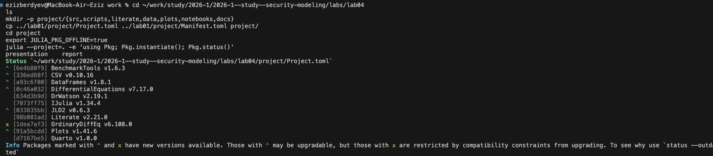
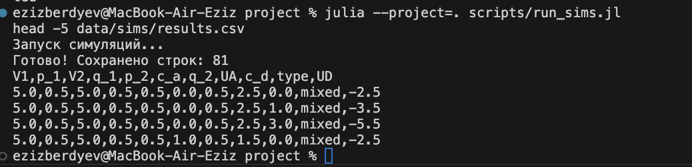
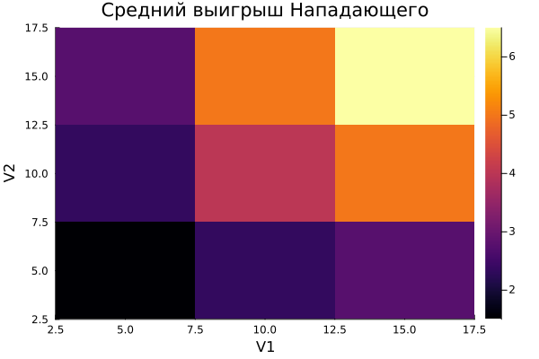

---
## Author
author:
  name: Бердыев Эзиз
  email: 1032255390@rudn.ru
  affiliation:
    - name: Российский университет дружбы народов
      country: Российская Федерация
      postal-code: 117198
      city: Москва
      address: ул. Миклухо-Маклая, д. 6

## Title
title: "Моделирование конфликта «Защитник–Нападающий»"
subtitle: "Лабораторная работа № 4"
license: "CC BY"
date: today
date-format: "YYYY-MM-DD"
---

# Цель работы

Целью лабораторной работы является освоение применения теории игр для анализа
противостояния в сфере информационной безопасности [@rudn_course]: построение
матричной игры и поиск равновесия Нэша в чистых и смешанных стратегиях
[@nash_noncooperative_1951].

# Задание

В соответствии с методическими указаниями [@rudn_course] требуется:

1. Формализовать конфликт «Защитник–Нападающий» в виде антагонистической игры.
2. Реализовать на Julia [@bezanson_julia_2017] функции расчёта платёжной
   матрицы, поиска равновесия Нэша и симуляции игры.
3. Визуализировать зависимость ожидаемого выигрыша и равновесных
   вероятностей от стоимости защиты и величины ущерба.
4. Создать рабочий каталог, установить пакеты, выполнить предложенный код.
5. Преобразовать код в литературный стиль и сгенерировать из него чистый код,
   jupyter notebook и документацию в формате Quarto.
6. Добавить в литературный код вычисление для набора параметров и повторить
   генерацию.
7. Интегрировать документацию в формате Quarto в отчёт.

# Теоретическое введение

## Теория игр в информационной безопасности

Ситуации, в которых взаимодействуют стороны с противоположными интересами,
описываются моделями теории игр [@neumann_morgenstern_1944]. Защитник
стремится минимизировать ущерб, Нападающий — максимизировать его. Такой подход
широко применяется для планирования защиты реальных объектов
[@tambe_security_games_2011].

Элементы модели сведены в [табл. @tbl-elements].

| Элемент        | Содержание в модели                                              |
|----------------|------------------------------------------------------------------|
| Игроки         | Защитник (Defender, D) и Нападающий (Attacker, A)                |
| Активы         | $n = 2$ актива с ценностями $V_1, V_2 > 0$                       |
| Стратегии      | Нападающий выбирает актив $i$ для атаки, Защитник — актив $j$    |
| Затраты        | $c_a$ — стоимость атаки, $c_d$ — стоимость защиты               |
| Тип игры       | Статическая: ходы одновременны, выбор противника неизвестен      |

: Основные элементы модели «Защитник–Нападающий» {#tbl-elements}

## Платёжные матрицы

Результат зависит от того, совпали ли атакуемый и защищаемый активы. Если
$i \neq j$, атака успешна; если $i = j$, атака отражена:

$$
A_{ij} =
\begin{cases}
V_i - c_a, & i \neq j, \\
-c_a, & i = j,
\end{cases}
\qquad
D_{ij} =
\begin{cases}
-V_i - c_d, & i \neq j, \\
-c_d, & i = j.
\end{cases}
$$ {#eq-payoff}

При смешанных стратегиях $\mathbf{p}$ (Нападающий) и $\mathbf{q}$ (Защитник)
ожидаемые выигрыши равны

$$
U_A = \mathbf{p}^T A \mathbf{q}, \qquad U_D = \mathbf{p}^T D \mathbf{q}.
$$ {#eq-utility}

## Равновесие Нэша

Пара стратегий $(\mathbf{p}^*, \mathbf{q}^*)$ — равновесие Нэша, если ни
одному игроку не выгодно в одиночку изменить свою стратегию
[@nash_noncooperative_1951]. Для игры $2 \times 2$ без чистого равновесия
смешанное находится из условия безразличия: при равновесной стратегии
противника ожидаемые выигрыши от обеих чистых стратегий равны:

$$
\begin{cases}
A_{11} q_1^* + A_{12}(1-q_1^*) = A_{21} q_1^* + A_{22}(1-q_1^*), \\
p_1^* D_{11} + (1-p_1^*) D_{21} = p_1^* D_{12} + (1-p_1^*) D_{22}.
\end{cases}
$$ {#eq-indifference}

Подстановка (@eq-payoff) в (@eq-indifference) даёт решение в явном виде:

$$
q_1^* = \frac{V_1}{V_1 + V_2}, \qquad p_1^* = \frac{V_2}{V_1 + V_2}.
$$ {#eq-solution}

Затраты $c_a$ и $c_d$ входят во все клетки своих матриц одинаково, поэтому
на равновесные вероятности (@eq-solution) не влияют, а лишь сдвигают
выигрыши.

# Выполнение лабораторной работы

## Рабочий каталог и окружение

Рабочий каталог `labs/lab04/project` создан в структуре DrWatson
[@datseris_drwatson_2020]. Окружение Julia воспроизводится из файлов
`Project.toml` и `Manifest.toml` с зафиксированными версиями пакетов
([рис. @fig-env]).

{#fig-env width=100%}

## Модель

Модель реализована в файле `src/simulation.jl`. Построение платёжных матриц
по формулам (@eq-payoff) приведено в [листинге @lst-payoff].

```{#lst-payoff .julia lst-cap="Построение платёжных матриц"}
function build_payoff_matrices(V::Vector{Float64}, c_a::Float64, c_d::Float64)
    n = length(V)
    A = zeros(n, n)  # Attacker
    D = zeros(n, n)  # Defender
    for i = 1:n, j = 1:n
        if i != j
            A[i, j] = V[i] - c_a
            D[i, j] = -V[i] - c_d
        else
            A[i, j] = -c_a
            D[i, j] = -c_d
        end
    end
    return A, D
end
```

Поиск равновесия ([листинг @lst-nash]) сначала проверяет чистые стратегии,
затем решает систему (@eq-indifference).

```{#lst-nash .julia lst-cap="Поиск равновесия Нэша для игры 2×2 (фрагмент)"}
for i = 1:2, j = 1:2
    if A[i, j] >= A[3-i, j] && D[i, j] >= D[i, 3-j]
        # чистое равновесие
    end
end
denomA = (A[1, 1] - A[2, 1]) - (A[1, 2] - A[2, 2])
q1 = clamp((A[2, 2] - A[1, 2]) / denomA, 0.0, 1.0)
denomD = (D[1, 1] - D[1, 2]) - (D[2, 1] - D[2, 2])
p1 = clamp((D[2, 2] - D[2, 1]) / denomD, 0.0, 1.0)
```

## Базовый эксперимент

Для $V = (10, 5)$, $c_a = c_d = 1$ получены матрицы и равновесие,
приведённые на [рис. @fig-base] и в [табл. @tbl-base].

{#fig-base width=100%}

| Величина                           | Значение              |
|------------------------------------|-----------------------|
| Матрица Нападающего $A$            | $[-1\ \ 9;\ 4\ \ -1]$ |
| Матрица Защитника $D$              | $[-1\ \ -11;\ -6\ \ -1]$ |
| Тип равновесия                     | смешанное             |
| Стратегия Нападающего $\mathbf{p}$ | $(1/3,\ 2/3)$         |
| Стратегия Защитника $\mathbf{q}$   | $(2/3,\ 1/3)$         |
| Выигрыш Нападающего $U_A$          | $2.33$                |
| Выигрыш Защитника $U_D$            | $-4.33$               |

: Результаты базового эксперимента при $V = (10, 5)$, $c_a = c_d = 1$ {#tbl-base}

Результат совпадает с аналитическим решением (@eq-solution):
$q_1^* = 10/15 = 2/3$, $p_1^* = 5/15 = 1/3$. Защитник чаще охраняет ценный
актив, поэтому Нападающему выгоднее чаще атаковать дешёвый. Для
симметричного случая $V = (10, 10)$ без затрат получено $p_1 = q_1 = 0.5$,
$U_A = 5$, $U_D = -5$: сумма выигрышей равна нулю — игра антагонистическая.

## Расчёт для набора параметров

Сценарий `scripts/run_sims.jl` рассчитывает все 81 комбинацию
$V_1, V_2 \in \{5, 10, 15\}$, $c_a, c_d \in \{0, 1, 3\}$ и сохраняет их в
`data/sims/results.csv` ([рис. @fig-sims]).

{#fig-sims width=100%}

Все 81 равновесие оказались смешанными. Причина в структуре игры: Защитнику
всегда выгодно угадать цель атаки, а Нападающему — не угадать, как в игре
«орлянка», поэтому чистого равновесия не существует. Срез при
$c_a = c_d = 1$ приведён в [табл. @tbl-grid].

| $V_1$ | $V_2$ | $p_1$ | $q_1$ | $U_A$ | $U_D$ |
|------:|------:|------:|------:|------:|------:|
| 5     | 5     | 0.500 | 0.500 | 1.50  | −3.50 |
| 5     | 10    | 0.667 | 0.333 | 2.33  | −4.33 |
| 5     | 15    | 0.750 | 0.250 | 2.75  | −4.75 |
| 10    | 5     | 0.333 | 0.667 | 2.33  | −4.33 |
| 10    | 10    | 0.500 | 0.500 | 4.00  | −6.00 |
| 10    | 15    | 0.600 | 0.400 | 5.00  | −7.00 |
| 15    | 5     | 0.250 | 0.750 | 2.75  | −4.75 |
| 15    | 10    | 0.400 | 0.600 | 5.00  | −7.00 |
| 15    | 15    | 0.500 | 0.500 | 6.50  | −8.50 |

: Равновесия и выигрыши при $c_a = c_d = 1$ {#tbl-grid}

## Визуализация

Зависимость вероятности атаки на актив 1 от отношения ценностей показана на
[рис. @fig-p1]: чем ценнее актив 1, тем реже его атакуют.

{#fig-p1 width=80%}

Средний выигрыш Нападающего ([рис. @fig-heat]) растёт, когда ценны оба
актива: максимум $6.5$ достигается при $V_1 = V_2 = 15$.

{#fig-heat width=80%}

Зависимость выигрыша Защитника от стоимости защиты ([рис. @fig-cd]) линейна:
при росте $c_d$ от 0 до 6 выигрыш падает с $-3.33$ до $-9.33$, а
равновесные стратегии не меняются.

{#fig-cd width=80%}

## Литературное программирование

Код переведён в литературный стиль средствами Literate.jl: два исходника в
каталоге `project/literate` — базовая модель и вычисление для набора
параметров. Из них сценарием `scripts/make_literate.jl` сгенерированы чистый
код, jupyter-блокноты и документация Quarto ([рис. @fig-literate]).

{#fig-literate width=100%}

Ниже интегрирована сгенерированная документация Quarto [@quarto_2026].

### Документация: базовая модель



### Документация: расчёт для набора параметров



# Ответы на контрольные вопросы

**1. Что такое антагонистическая игра? Почему модель можно считать игрой с
нулевой суммой?**

Антагонистическая игра — игра двух лиц с противоположными интересами:
выигрыш одного равен проигрышу другого. Без затрат $c_a = c_d = 0$ выигрыш
Нападающего $V_i$ равен ущербу Защитника, и $U_A + U_D = 0$ (в симметричном
случае $+5$ и $-5$). Затраты делают сумму отрицательной, но конфликт
интересов сохраняется.

**2. Дайте определение равновесия Нэша в чистых и смешанных стратегиях.
Приведите пример, когда чистого равновесия не существует.**

Равновесие Нэша — пара стратегий, от которой ни одному игроку невыгодно
отклоняться в одиночку [@nash_noncooperative_1951]. В чистых стратегиях
каждый выбирает одно действие, в смешанных — распределение вероятностей.
Пример без чистого равновесия — «орлянка» и рассмотренная модель: все 81
вариант дали смешанное равновесие.

**3. Как изменится стратегия Защитника, если ущерб от атаки на незащищённый
сервер станет бесконечно большим?**

По (@eq-solution) $q_1^* = V_1/(V_1+V_2) \to 1$ при $V_1 \to \infty$:
Защитник практически всегда защищает этот сервер.

**4. Зачем в ИБ применяют смешанные стратегии? Примеры.**

Предсказуемая защита эксплуатируется противником, а рандомизация лишает его
гарантированной цели. Примеры: ротация honeypot-ловушек, случайное
перераспределение ресурсов мониторинга, случайные проверки, moving target
defense [@tambe_security_games_2011].

# Выводы

- Конфликт «Защитник–Нападающий» формализован как биматричная игра
  (@eq-payoff), реализованы построение платёжных матриц и поиск равновесия
  Нэша.
- В базовом эксперименте получено смешанное равновесие
  $\mathbf{p} = (1/3, 2/3)$, $\mathbf{q} = (2/3, 1/3)$, совпадающее с
  аналитическим решением (@eq-solution) (см. [табл. @tbl-base]).
- Расчёт для 81 набора параметров показал, что в модели равновесие всегда
  смешанное: Нападающий реже атакует ценный актив, так как тот лучше защищён
  (см. [рис. @fig-p1]).
- Стоимость защиты влияет только на выигрыш Защитника, но не на стратегии
  (см. [рис. @fig-cd]): безопасность всегда требует затрат.
- Код переведён в литературный стиль, сгенерированы чистый код,
  jupyter-блокноты и документация Quarto, интегрированная в отчёт.

# Список литературы {.unnumbered}

::: {#refs}
:::
