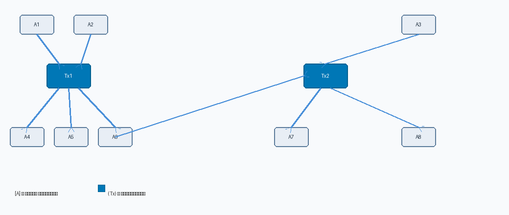

<!-- _class: title-slide -->
<!-- _paginate: false -->

# Математические модели деанонимизации в сетях Tor и Bitcoin

<div class="subtitle">Анализ графов транзакций и временных меток</div>

<div class="meta-row"><span class="meta-label">Автор:</span><span class="meta-value">Бердыев Эзиз</span></div>
<div class="meta-row"><span class="meta-label">Преподаватель:</span><span class="meta-value">Кулябов Дмитрий Сергеевич, доктор физико-математических наук, профессор кафедры теории вероятностей и кибербезопасности</span></div>
<div class="meta-row"><span class="meta-label">Организация:</span><span class="meta-value">РУДН им. Патриса Лумумбы</span></div>
<div class="meta-row"><span class="meta-label">Год:</span><span class="meta-value">2026</span></div>

---

<!-- _footer: "Бердыев Э. · Деанонимизация Tor и Bitcoin" -->

<!-- _class: speaker-slide -->

# Информация о докладчике

<div class="columns-speaker">

<div style="background:#162232; border-radius:8px; padding:14px 12px; text-align:center; display:flex; flex-direction:column; align-items:center; justify-content:center;">


<div style="font-size:16pt; font-weight:bold; color:#FFFFFF; line-height:1.25;">Бердыев<br>Эзиз</div>
<div style="font-size:11pt; color:#00B4D8; margin-top:4px; line-height:1.3;">Студент<br>каф. теории вероятностей<br>и кибербезопасности</div>

</div>

<div class="speaker-cards">

<div class="card">
<span class="card-icon">🎓</span><br>
<strong style="color:#00B4D8;">Учебное заведение</strong><br>
<span>РУДН им. Патриса Лумумбы<br>Фак. физ.-мат. и естеств. наук</span>
</div>

<div class="card">
<span class="card-icon">📚</span><br>
<strong style="color:#00B4D8;">Направление</strong><br>
<span>Фундам. информатика и ИТ<br>Беспроводные сети, IoT, кибербезопасность</span>
</div>

<div class="card">
<span class="card-icon">🔬</span><br>
<strong style="color:#00B4D8;">Область исследований</strong><br>
<span>Сетевая анонимность, криптовалюты, теория графов</span>
</div>

<div class="card">
<span class="card-icon">📧</span><br>
<strong style="color:#00B4D8;">Контакт</strong><br>
<span>1032255390@rudn.ru</span>
</div>

</div>

</div>

---

<!-- _footer: "Бердыев Э. · Деанонимизация Tor и Bitcoin" -->

# Вводная часть: актуальность и предмет исследования

<div class="columns">

<div>
<div class="card" style="margin-bottom:14px;">

## 📈 Актуальность

- Пользователи Tor: **>2 млн/сутки**
- Оборот Bitcoin 2024: **>$1 трлн**
- Злоупотребления: отмывание средств, DarkNet

</div>
<div class="card">

## 🆕 Научная новизна

Единая математическая рамка (теория графов + теория информации) для Tor и Bitcoin одновременно. Сравнительный анализ всех современных методов.

</div>
</div>

<div>
<div class="card" style="margin-bottom:14px;">

## 🔍 Объект и предмет

- **Объект:** сети Tor и блокчейн Bitcoin
- **Предмет:** математические модели деанонимизации на основе графов транзакций и временных меток

</div>
<div class="card">

## ⚙️ Практическая значимость

- **Правоохранителям:** инструменты расследования
- **Разработчикам:** понимание векторов атак для проектирования защиты

</div>
</div>

</div>

---

<!-- _footer: "Бердыев Э. · Деанонимизация Tor и Bitcoin" -->

# Цель, гипотеза и задачи исследования

<div class="columns">

<div class="card card-yellow">

## 🎯 Цель

Систематизировать и сравнить математические методы деанонимизации в сетях Tor и Bitcoin, оценить их эффективность и границы применимости.

</div>

<div class="card card-yellow">

## 💡 Гипотеза

Структурные и временны́е паттерны в псевдоанонимных сетях содержат достаточно информации для деанонимизации значительной доли пользователей **без криптографического взлома**.

</div>

</div>

<div style="margin-top:14px;">

## 📋 Задачи исследования

<div style="margin:6px 0; display:flex; align-items:center;"><span class="badge">1</span>Обзор методов деанонимизации Tor: корреляция трафика, timing-атаки, fingerprinting</div>
<div style="margin:6px 0; display:flex; align-items:center;"><span class="badge">2</span>Обзор методов кластеризации Bitcoin-адресов: эвристики UTXO, CoinJoin-анализ</div>
<div style="margin:6px 0; display:flex; align-items:center;"><span class="badge">3</span>Формализация атак на основе временных меток (Clock Skew, Propagation Timing)</div>
<div style="margin:6px 0; display:flex; align-items:center;"><span class="badge">4</span>Сравнительный анализ точности и вычислительной сложности всех методов</div>
<div style="margin:6px 0; display:flex; align-items:center;"><span class="badge">5</span>Оценка существующих противомер и их эффективности</div>

</div>

---

<!-- _footer: "Бердыев Э. · Деанонимизация Tor и Bitcoin" -->

# Материалы, методы и инструменты

<div class="columns3">

<div class="card">

## 📐 Теоретическая база

- Теория графов: G = (V, E)
- Скрытые марковские модели (HMM)
- Теория информации: I(X;Y)
- Байесовский вывод
- Методы MLE

</div>

<div class="card">

## 🗄️ Данные и источники

- Blockchair (открытый блокчейн)
- WalletExplorer (теги кошельков)
- Tor Project Metrics
- Экспериментальные стенды Tor
- Публичные датасеты транзакций

</div>

<div class="card">

## 🛠️ Инструменты

- Python: NetworkX (графы)
- scikit-learn (кластеризация)
- scipy (статистика)
- Bitcoin Core RPC
- Wireshark / tshark

</div>

</div>

---

<!-- _footer: "Бердыев Э. · Деанонимизация Tor и Bitcoin" -->

# Математические методы деанонимизации Tor

<div class="columns">

<div>

<div class="method-row">
<div>
<div class="method-title">End-to-End Correlation</div>
<div class="method-desc">Корреляция ρ(x,y): противник контролирует ≥10% узлов</div>
</div>
<span class="acc-badge">95%</span>
</div>

<div class="method-row">
<div>
<div class="method-title">Website Fingerprinting</div>
<div class="method-desc">Классификатор по вектору признаков f = (длины пакетов, интервалы)</div>
</div>
<span class="acc-badge">85–91%</span>
</div>

<div class="method-row">
<div>
<div class="method-title">Clock Skew Fingerprinting</div>
<div class="method-desc">Дрейф часов Δ(t) = αt + β: α — уникальный «отпечаток» устройства</div>
</div>
<span class="acc-badge">Уникально</span>
</div>

<div class="method-row">
<div>
<div class="method-title">Timing Attack (RTT)</div>
<div class="method-desc">RTT = 2dᵢ + ε, ε ~ N(0,σ²): триангуляция через MLE</div>
</div>
<span class="acc-badge">70–80%</span>
</div>

</div>

<div>

<strong style="color:#00B4D8; font-size:14pt;">Точность методов</strong>

| Метод              | Точность      |
| ------------------ | ------------- |
| End-to-End Corr.   | **95%**       |
| Web Fingerprinting | **85–91%**    |
| Timing Attack      | **70–80%**    |
| Clock Skew         | **Уникально** |

</div>

</div>

---

<!-- _footer: "Бердыев Э. · Деанонимизация Tor и Bitcoin" -->

# Деанонимизация Bitcoin: анализ графов транзакций

<div class="columns">

<div class="card">

**Граф транзакций Bitcoin**



</div>

<div>

<div class="card" style="margin-bottom:10px;">
<strong style="color:#FFFFFF; font-size:14pt;">Common-Input Ownership</strong><br>
<code style="font-size:12pt;">cluster(T) = ∪ cluster(aᵢ)  для всех входов Tx</code><br>
<span style="color:#7F8FA6; font-size:12pt;">Несколько входов = один владелец кошелька</span><br>
<span style="background:#0077B6; color:#FFF; font-size:11pt; padding:2px 9px; border-radius:3px; font-weight:bold; margin-top:5px; display:inline-block;">Точн.: 70–90%</span>
<span style="background:#2A3F55; color:#7F8FA6; font-size:11pt; padding:2px 9px; border-radius:3px; margin-left:6px;">O(n·α(n))</span>
</div>

<div class="card" style="margin-bottom:10px;">
<strong style="color:#FFFFFF; font-size:14pt;">Change Address Heuristic</strong><br>
<code style="font-size:12pt;">Новый адрес + меньший выход = сдача</code><br>
<span style="color:#7F8FA6; font-size:12pt;">Сдача возвращается тому же кошельку</span><br>
<span style="background:#0077B6; color:#FFF; font-size:11pt; padding:2px 9px; border-radius:3px; font-weight:bold; margin-top:5px; display:inline-block;">Точн.: 60–80%</span>
<span style="background:#2A3F55; color:#7F8FA6; font-size:11pt; padding:2px 9px; border-radius:3px; margin-left:6px;">O(n)</span>
</div>

<div class="card">
<strong style="color:#FFFFFF; font-size:14pt;">CoinJoin Decomposition</strong><br>
<code style="font-size:12pt;">Алгоритм Möbius: декомпозиция мультиграфа</code><br>
<span style="color:#7F8FA6; font-size:12pt;">Восстановление потоков в смешанных транзакциях</span><br>
<span style="background:#0077B6; color:#FFF; font-size:11pt; padding:2px 9px; border-radius:3px; font-weight:bold; margin-top:5px; display:inline-block;">Точн.: 60–90%</span>
<span style="background:#2A3F55; color:#7F8FA6; font-size:11pt; padding:2px 9px; border-radius:3px; margin-left:6px;">O(k!)</span>
</div>

</div>

</div>

---

<!-- _footer: "Бердыев Э. · Деанонимизация Tor и Bitcoin" -->

# Атаки на основе временны́х меток

<div class="columns">

<div class="card">

## 🧅 Tor: Clock Skew Fingerprinting

Каждое устройство имеет уникальный дрейф часов:

```
Δ(t) = α·t + β + ε(t)
```

- **α** — скорость дрейфа (fingerprint)
- **β** — начальное смещение
- **ε(t)** — случайный шум

Регрессионная оценка **α** по меткам HTTP/Tor однозначно идентифицирует устройство.

**Точность:** уникальная идентификация устройства

**Противомера:** NTP desync, виртуальные часы

</div>

<div class="card card-yellow">

## ₿ Bitcoin: Propagation Timing

Узел-источник первым рассылает транзакцию. Наблюдая `{tᵢ}` на N узлах:

```
v̂ = argmin_v Σᵢ (tᵢ − d(v,i)/c)²
```

- **d(v,i)** — расстояние в сети
- **c** — скорость распространения

**Точность:** 30–60% при 20% наблюдателей

**Противомера:** Dandelion++ снижает до <10%

_«стебель»: цепочка → «одуванчик»: P2P_

</div>

</div>

---

<!-- _footer: "Бердыев Э. · Деанонимизация Tor и Bitcoin" -->

# Сравнительный анализ методов и практические результаты

| Метод                  | Сеть    | Точность      | Стоимость    | Противомера             |
| ---------------------- | ------- | ------------- | ------------ | ----------------------- |
| End-to-End Correlation | Tor     | **95%**       | Высокая      | Padding, трафик-дамп    |
| Website Fingerprinting | Tor     | **85–91%**    | Низкая       | WTF-PAD, обфускация     |
| Clock Skew             | Tor     | **Уникально** | Низкая       | NTP desync, virt. clock |
| Common-Input Heuristic | Bitcoin | **70–90%**    | Очень низкая | CoinJoin, Schnorr       |
| Change Address         | Bitcoin | **60–80%**    | Очень низкая | Taproot, HD-кошельки    |
| Propagation Timing     | Bitcoin | **30–60%**    | Средняя      | Dandelion++             |

<div class="columns" style="margin-top:16px;">

<div class="highlight-red">
🔴 <strong>Tor</strong> наиболее уязвим при global passive adversary (≥10% узлов): корреляция трафика ~95% без криптовзлома.
</div>

<div class="highlight-green">
🟢 <strong>Dandelion++</strong> (Bitcoin) и <strong>WTF-PAD</strong> (Tor) — наиболее перспективные противомеры на сегодня.
</div>

</div>

---

<!-- _class: conclusion -->
<!-- _footer: "Бердыев Э. · Деанонимизация Tor и Bitcoin" -->

# Выводы

<div style="margin-top:12px;">

<div style="margin:10px 0; display:flex; align-items:flex-start;">
<span class="badge" style="margin-top:2px;">1</span>
<span style="font-size:14pt;">Tor уязвим к end-to-end correlation (~95%) при контроле ≥10% узлов и к Website Fingerprinting (~85–91%) без контроля инфраструктуры.</span>
</div>

<div style="margin:10px 0; display:flex; align-items:flex-start;">
<span class="badge badge-yellow" style="margin-top:2px;">2</span>
<span style="font-size:14pt;">Bitcoin псевдоанонимен: эвристики кластеризации (70–90%) позволяют отследить большинство транзакций; Propagation Timing — источник с точностью 30–60%.</span>
</div>

<div style="margin:10px 0; display:flex; align-items:flex-start;">
<span class="badge" style="margin-top:2px;">3</span>
<span style="font-size:14pt;">Временны́е метки — самостоятельный вектор атак: Clock Skew fingerprinting уникально идентифицирует устройства в сети Tor.</span>
</div>

<div style="margin:10px 0; display:flex; align-items:flex-start;">
<span class="badge badge-yellow" style="margin-top:2px;">4</span>
<span style="font-size:14pt;">Dandelion++ снижает timing-атаки до &lt;10%; WTF-PAD ограничивает fingerprinting; Taproot уменьшает применимость CIOH.</span>
</div>

<div style="margin:10px 0; display:flex; align-items:flex-start;">
<span class="badge" style="margin-top:2px;">5</span>
<span style="font-size:14pt;">Необходима разработка криптографически строгих гарантий анонимности — текущие протоколы не дают формальных гарантий против активного глобального наблюдателя.</span>
</div>

</div>
